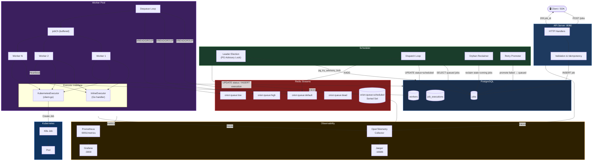
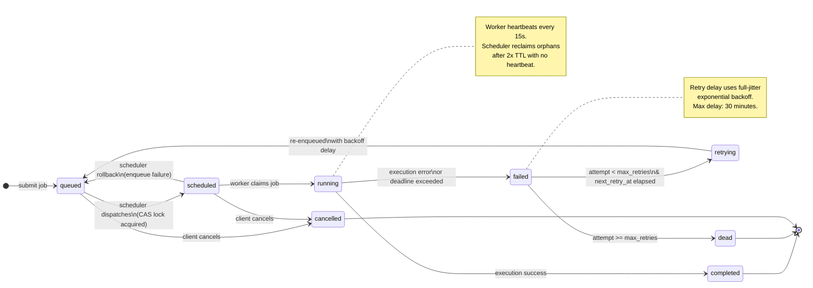
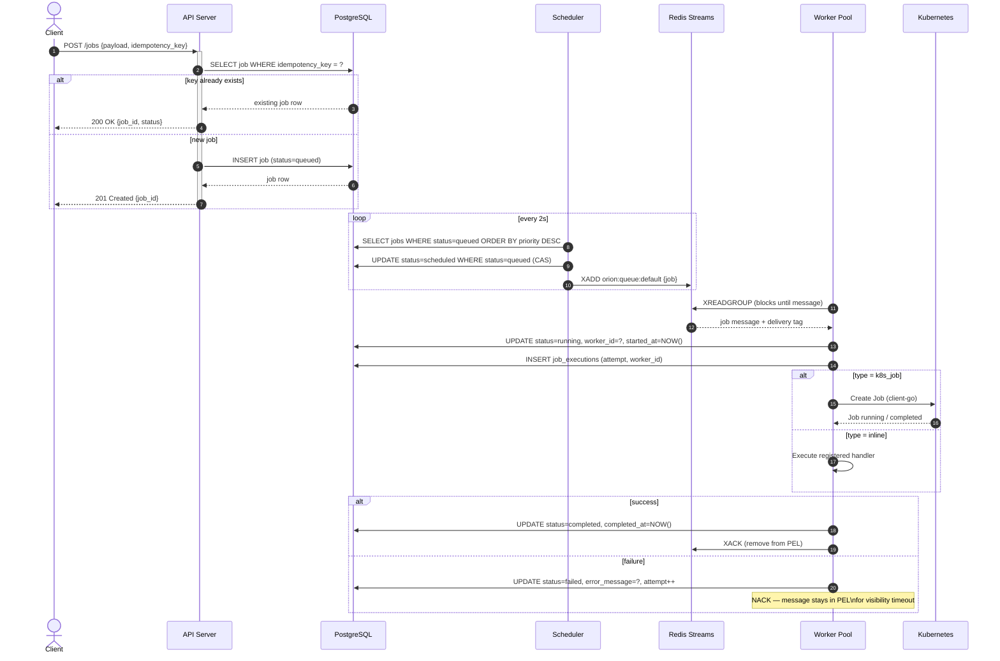
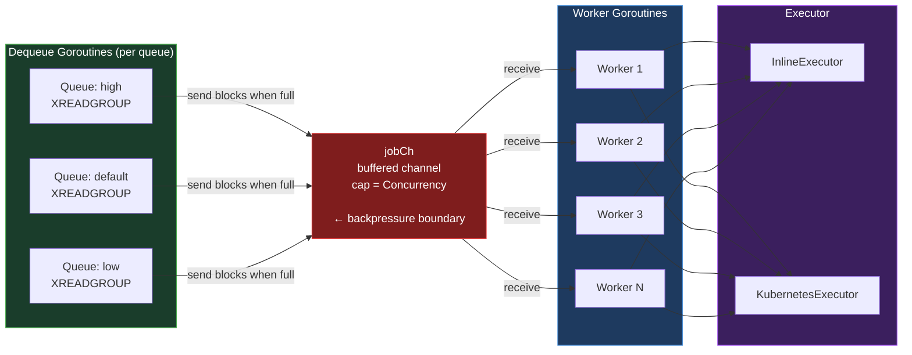
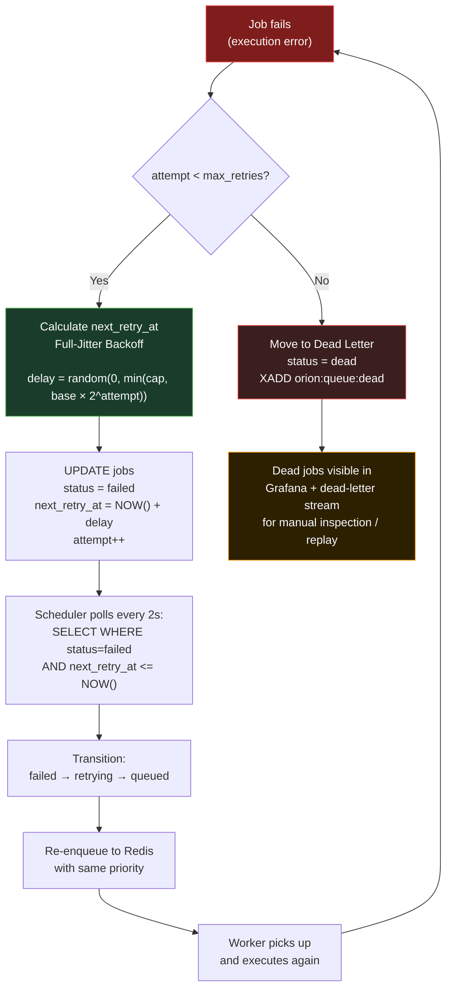
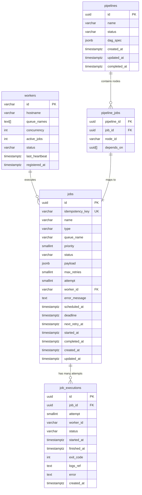
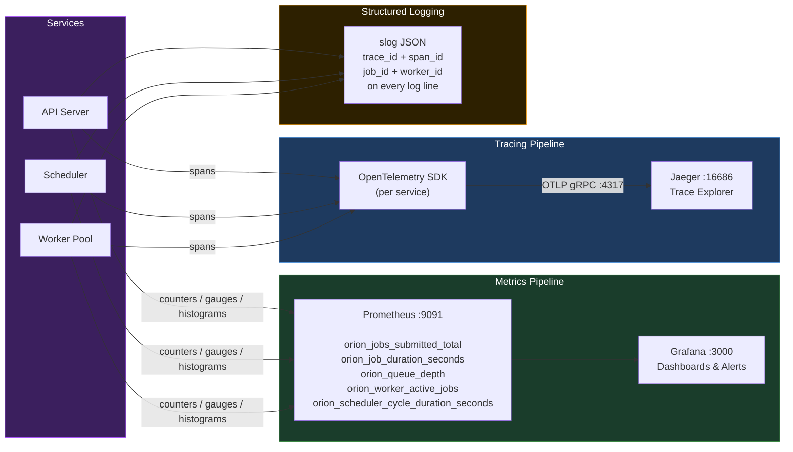

# Orion — Distributed ML Job Orchestrator

Orion is a production-grade distributed job orchestration platform written in Go. It schedules, executes, and monitors machine learning workloads on Kubernetes.

Designed to demonstrate senior-level backend engineering: distributed systems, Go concurrency, observability, and cloud-native architecture.

---

## System Architecture




---

## Job Lifecycle State Machine



---

## Request Flow: Job Submission



---

## Worker Pool Concurrency Model



> **Backpressure:** `jobCh` capacity equals `Concurrency`. When all workers are busy, sending blocks the dequeue goroutine, which stops pulling from Redis. No jobs are prefetched beyond what can be immediately worked on.

---

## Retry & Backoff Strategy



---

## Database Schema



---

## Observability Stack



---

## Project Structure

```
orion/
├── cmd/
│   ├── api/              # API server entrypoint
│   ├── scheduler/        # Scheduler entrypoint
│   └── worker/           # Worker entrypoint
├── internal/
│   ├── api/handler/      # HTTP handlers, DTOs
│   ├── config/           # Environment-driven config
│   ├── domain/           # Job, Worker, Pipeline types (zero external deps)
│   ├── observability/    # OTel setup, Prometheus, structured logging
│   ├── queue/            # Queue interface + Redis Streams implementation
│   ├── scheduler/        # Dispatch loop, leader election, orphan reclaim
│   ├── store/            # Store interface + PostgreSQL implementation
│   │   └── migrations/   # SQL migration files (golang-migrate)
│   ├── worker/           # Bounded worker pool, executor interface
│   └── k8s/              # Kubernetes Job launcher (client-go)
├── pkg/
│   └── retry/            # Exportable full-jitter backoff utilities
├── proto/                # .proto definitions + generated gRPC code
├── deploy/
│   ├── helm/             # Helm chart for Kubernetes deployment
│   └── docker/           # Per-service Dockerfiles
├── docs/
│   └── adr/              # Architecture Decision Records
├── docker-compose.yml
└── Makefile
```

---

## Getting Started

### Prerequisites
- Go 1.22+
- Docker + Docker Compose
- `golang-migrate` for schema migrations

### Local Development

```bash
# Start all infrastructure (Postgres, Redis, Jaeger, Prometheus, Grafana)
make infra-up

# Apply schema migrations
make migrate-up

# Run each service in a separate terminal
make run-api
make run-scheduler
make run-worker
```

### Submit a Job

```bash
curl -X POST http://localhost:8080/jobs \
  -H "Content-Type: application/json" \
  -d '{
    "name": "train-mnist",
    "type": "k8s_job",
    "queue_name": "default",
    "priority": 7,
    "max_retries": 3,
    "idempotency_key": "run-2024-001",
    "payload": {
      "kubernetes_spec": {
        "image": "pytorch/pytorch:2.1.0-cuda11.8-cudnn8-runtime",
        "command": ["python", "train.py"],
        "namespace": "orion-jobs",
        "resources": { "cpu": "2000m", "memory": "4Gi" }
      }
    }
  }'
```

### Observability Endpoints

| Service    | URL                                 |
|------------|-------------------------------------|
| API Server | http://localhost:8080               |
| Prometheus | http://localhost:9090               |
| Grafana    | http://localhost:3000 (admin/admin) |
| Jaeger UI  | http://localhost:16686              |

---

## Key Engineering Decisions

See `docs/adr/` for full Architecture Decision Records:

- **ADR-001**: Redis Streams with consumer groups for at-least-once delivery
- **ADR-002**: PostgreSQL advisory locks for scheduler leader election

## Design Principles

1. **State transitions are atomic CAS operations** — `UPDATE WHERE status = expected_status` prevents concurrent mutation from multiple workers or schedulers
2. **Queue interface is abstract** — Redis can be swapped for NATS JetStream or Kafka without touching worker or scheduler logic
3. **Full-jitter backoff** — `random(0, min(cap, base × 2^attempt))` prevents thundering herds during retry storms
4. **Append-only execution log** — `job_executions` rows are never mutated; each attempt gets its own immutable record
5. **Idempotency keys** — clients retry job submissions safely; duplicate submissions return the original job
6. **Graceful shutdown** — `SIGTERM` stops accepting new work, drains in-flight jobs, then exits cleanly

---

## Development Roadmap

- [x] Phase 1: Domain types, interfaces, project structure
- [ ] Phase 2: PostgreSQL store implementation (`internal/store/postgres/`)
- [ ] Phase 3: Redis queue full implementation + PEL sweeper
- [ ] Phase 4: Worker pool + inline executor
- [ ] Phase 5: Kubernetes executor via client-go
- [ ] Phase 6: Scheduler + leader election wiring
- [ ] Phase 7: Observability instrumentation (spans on every layer)
- [ ] Phase 8: DAG pipeline support
- [ ] Phase 9: Helm chart + production hardening
