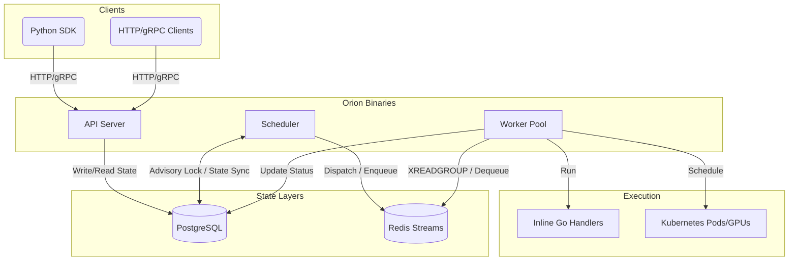

# Orion — Architecture Overview

## 1. Executive Summary

Orion is a production-grade distributed ML job orchestrator built in Go. Its sole purpose is to reliably execute machine learning workloads—ranging from lightweight inline Go preprocessing functions to heavy, GPU-bound distributed training jobs on Kubernetes. 

Orion guarantees:
- **Exactly-once execution** of jobs, ensuring no duplication even under concurrent submissions or worker failures.
- **Resilience and self-healing**, recovering orphaned jobs and retrying transients using exponential full-jitter backoff.
- **Fair resource allocation** across priority queues (high, default, low) using token-bucket rate limiting and weighted fair scheduling.
- **Strict idempotency** for all operations.

## 2. High-Level Architecture

Orion splits responsibilities across three stateless, independently scalable binaries, backed by two stateful infrastructure layers.



### Component Roles
- **API Server:** Handles REST and gRPC requests. It performs CRUD on the database. It is entirely ignorant of queues or execution logic.
- **Scheduler:** The "brain" of Orion. Runs as a singleton leader (elected via PG advisory lock). Sweeps the DB for jobs ready to run and pushes them into Redis Streams. Advances DAG pipelines.
- **Worker:** The "muscle". Dequeues jobs from Redis, executes them via pluggable executors (Inline, Kubernetes), and reports completion status back to the database.

## 3. Core Principles & Design Decisions

### PostgreSQL as the Single Source of Truth
PostgreSQL holds all state: jobs, executions, workers, pipelines. Redis is *only* a transient transport queue. If Redis is wiped, the system recovers by pushing `queued` jobs back into Redis. 

**Compare-and-Swap (CAS):**
State transitions (e.g. `queued` -> `scheduled` -> `running`) use SQL-level atomic Compare-And-Swap.
```sql
UPDATE jobs SET status = $new_status 
WHERE id = $id AND status = $expected_status 
RETURNING id;
```
This ensures no two workers can claim a job simultaneously, and race conditions naturally resolve (the loser gets an `ErrStateConflict`).

### Redis Streams for Delivery
We chose Redis Streams over Lists because of its Pending Entries List (PEL) and `XACK` semantics.
- A job popped from Redis stays in the PEL until the worker explicitly calls `XACK`.
- If a worker crashes mid-execution, the job is not lost. The scheduler's orphan reclaimer spots the dead worker in Postgres, resets the job to `queued`, and re-enqueues it. Stale messages in Redis are cleared out via `XAUTOCLAIM`.

### Goroutine Backpressure Model
The Worker binary avoids memory leaks and limits concurrency using a buffered channel.
```go
jobCh := make(chan domain.Job, cfg.Concurrency)
```
N `dequeue` goroutines pull from Redis and block on `jobCh <- job`. N `executor` goroutines pull from `<-jobCh`. This enforces strict backpressure. Jobs remain safely in Redis until a worker slot is actively free.

## 4. Key Workflows & Data Flow

### Job Submission & Idempotency
1. Client POSTs to `/jobs` with an `idempotency_key`.
2. API checks if the key exists.
3. If not, API attempts an `INSERT`. If two identical requests hit the DB at the precise same millisecond, the DB unique constraint on `idempotency_key` throws `23505 unique_violation`.
4. The loser catches the error, fetches the winner's row, and returns the identical response. Both clients receive a `201 Created` or `200 OK` with the exact same Job ID.

### Pipeline DAG Advancement
Pipelines are directed acyclic graphs of jobs.
1. The Scheduler runs `AdvanceAll()` every 2 seconds.
2. It fetches all pipeline node statuses in a single JOIN query.
3. It performs a topological graph traversal (`ReadyNodes()`).
4. Nodes whose parents are all `completed` are dynamically converted into Jobs and `INSERT`ed into PostgreSQL.
5. **Cascade Cancel:** If any node fails and exhausts retries, the scheduler automatically creates `cancelled` job records for all downstream nodes, failing the pipeline.

### Leader Election
The Scheduler uses PostgreSQL Session-level Advisory Locks.
```sql
SELECT pg_try_advisory_lock(12345);
```
- A dedicated `pgxpool.Conn` is acquired and held for the entire leader tenure.
- If the scheduler process crashes, the OS closes the TCP socket, PostgreSQL drops the session, and the lock is instantly released. Standby schedulers (polling every 3s) immediately take over. Zero ZooKeeper/etcd infrastructure required.

## 5. Subsystems Deep Dive

### The Fair Queue & Rate Limiting
Orion supports `high`, `default`, and `low` queues.
The scheduler implements a **Token Bucket** per queue and a **Weighted Fair Dispatcher**.
- High-priority jobs don't starve low-priority jobs. The dispatcher computes allocations based on weights (e.g. High=10, Default=5, Low=1). 
- If a queue exceeds its `ORION_QUEUE_HIGH_CONCURRENCY` limit, it is rate-limited. The scheduler leaves those jobs in PG until worker slots open up.

### Cross-Process Job Cancellation
When a user calls `POST /jobs/{id}/cancel` on a `running` job:
1. The API server publishes a message to a Redis pub/sub channel (`orion:cancel`).
2. Every Worker subscribes to this channel.
3. When the signal is received, the worker looks up the running job's `context.CancelFunc` from a thread-safe local registry and triggers it.
4. The executor aborts (e.g., K8s executor deletes the GPU pod with `Foreground` propagation), and the job transitions to `cancelled`.

## 6. Failure Modes & Recovery

| Failure | Recovery |
|---|---|
| Worker crashes mid-job | PEL reclaimer (`XAUTOCLAIM`) redelivers after visibility timeout |
| Worker goes silent | Orphan reclaimer resets job to `queued` after 90s |
| Scheduler crashes | Another instance acquires advisory lock within 3s |
| Redis unavailable | Workers block in `XREADGROUP`; no data loss |
| PostgreSQL unavailable | All operations fail loudly; jobs stay in Redis PEL |

## 7. Extension Points

**Adding a New Executor:**
Implement `worker.Executor`:
```go
type Executor interface {
    CanExecute(jobType domain.JobType) bool
    Execute(ctx context.Context, job *domain.Job) error
}
```
Inject it into the worker pool. Orion automatically routes jobs based on their `Type` (e.g., `inline`, `k8s_job`).

**Adding an Inline Handler:**
Register it at startup in `cmd/worker/main.go`:
```go
registry.Register("my_handler", func(ctx context.Context, job *domain.Job) error {
    // Custom ML preprocessing logic here
    return nil
})
```

## 8. Architectural Decision Records (ADRs)

See `docs/adr/` for full rationale on specific decisions.

| Decision | ADR |
|---|---|
| Redis Streams over Redis Lists/PubSub | ADR-001 |
| PostgreSQL advisory locks for scheduler leader election | ADR-002 |
| CAS state transitions via `UPDATE WHERE status = expected` | ADR-003 |
| Buffered channel backpressure in worker pool | ADR-004 |
| JSONB for job payload and DAG spec | ADR-007 |
| Token Bucket per-queue rate limiting | ADR-009 |
| Weighted fair scheduling across queues | ADR-010 |

## 9. Tradeoffs & Limitations
- **Latency:** Because the Scheduler polls PG every 2s for queued jobs, the minimum latency from submission to execution is ~1-2 seconds. This is acceptable for ML workloads but not for real-time microservices.
- **Pipeline Depth:** DAGs are currently limited to simple task dependencies; conditional branching (if/else) is not natively supported in the DAG engine.
- **PostgreSQL Write Load:** Since every state change writes to PG, horizontal scale is ultimately bounded by the primary DB's write capacity. However, batch operations and tuned indexes (e.g., `idx_jobs_retry_eligible`) easily support thousands of jobs per second.
