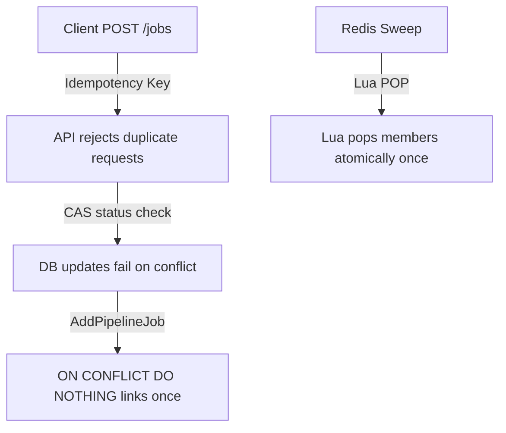
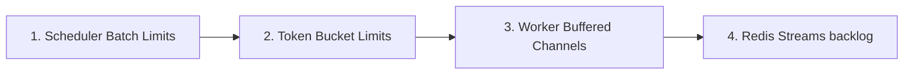

# Distributed Systems Principles

Orion is engineered as a highly available, eventually consistent distributed orchestrator built on top of a relational database state engine.

---

## Authority & Consistency Model

* **PostgreSQL as the Source of Truth:** All durable state (job definitions, execution runs, node dependencies) is persisted in PostgreSQL. Redis is treated as a transient message transport. If Redis loses data or is wiped, Orion can reconstruct its state and re-dispatch pending messages from the database.
* **Row-Level Consistency:** PostgreSQL row changes provide strong consistency per task or pipeline node.
* **Eventually Consistent Orchestration:** The interactions between the API, Redis Streams, Worker nodes, and gRPC push streams are eventually consistent. For example, a task status may update in the database before the watch event reaches a client, or a scheduler may mark a job as `scheduled` before it is successfully pushed to Redis. Orion handles these temporary gaps through automatic correction runs (e.g. orphan sweeps).

---

## Multi-Layered Idempotency

Orion does not assume exactly-once delivery from its network layers. Instead, it ensures safety by enforcing **idempotency** across every subsystem:

* **API Submission:** Client submissions support an `idempotency_key` parameter. Re-submitting the same key returns the existing job structure without spawning duplicates.
* **Database Updates (CAS):** State updates execute Compare-and-Swap queries (e.g. checking `status = 'scheduled'` before setting `status = 'running'`). If a task has already been processed by another worker, the update fails.
* **Pipeline Joining:** Linking spawned jobs to pipeline nodes uses `AddPipelineJob` with an `ON CONFLICT DO NOTHING` constraint, ensuring a node is linked to at most one job.
* **Queue Popping:** Expired scheduled tasks are popped from Redis ZSETs using atomic Lua scripts, preventing multiple scheduler pods from processing the same scheduled triggers concurrently.

---

## Multi-Level Backpressure

To prevent memory exhaustion and buffer overflows under heavy workload spikes, Orion applies backpressure control at four distinct boundaries:

1. **Scheduler Batch Limits:** The scheduler limits the max number of ready jobs fetched per tick, capping database query weights.
2. **Token Bucket Rate Limits:** Enforces maximum submission rates per queue to protect downstream APIs.
3. **Worker Buffered Channels:** The worker's dequeue loop blocks on sending to the in-process `jobCh` when all worker goroutines are active.
4. **Redis Streams Backlog:** Unprocessed tasks build up inside the Redis stream queue, which can be monitored by Kubernetes Horizontal Pod Autoscalers (HPA) to scale up worker pods.

---

## Fault Tolerance Mechanisms

Orion manages distributed component failures through self-healing loops:

* **Active/Passive Redundancy:** If the active scheduler leader crashes, PostgreSQL releases its advisory lock, allowing a standby standby pod to assume leadership.
* **Stale Message Recovery:** If a worker crashes mid-task, its active jobs are reclaimed:
  * **Redis PEL Reclaims:** Reclaims messages stuck in the Pending Entries List.
  * **Database Orphan Sweeps:** The scheduler scans for active jobs bound to workers that have missed their heartbeats, resetting them to `queued` or `failed`.
* **Resilient Watchers:** Watches on gRPC streams or client-go endpoints automatically fall back to periodic polling if the primary streaming socket drops.
