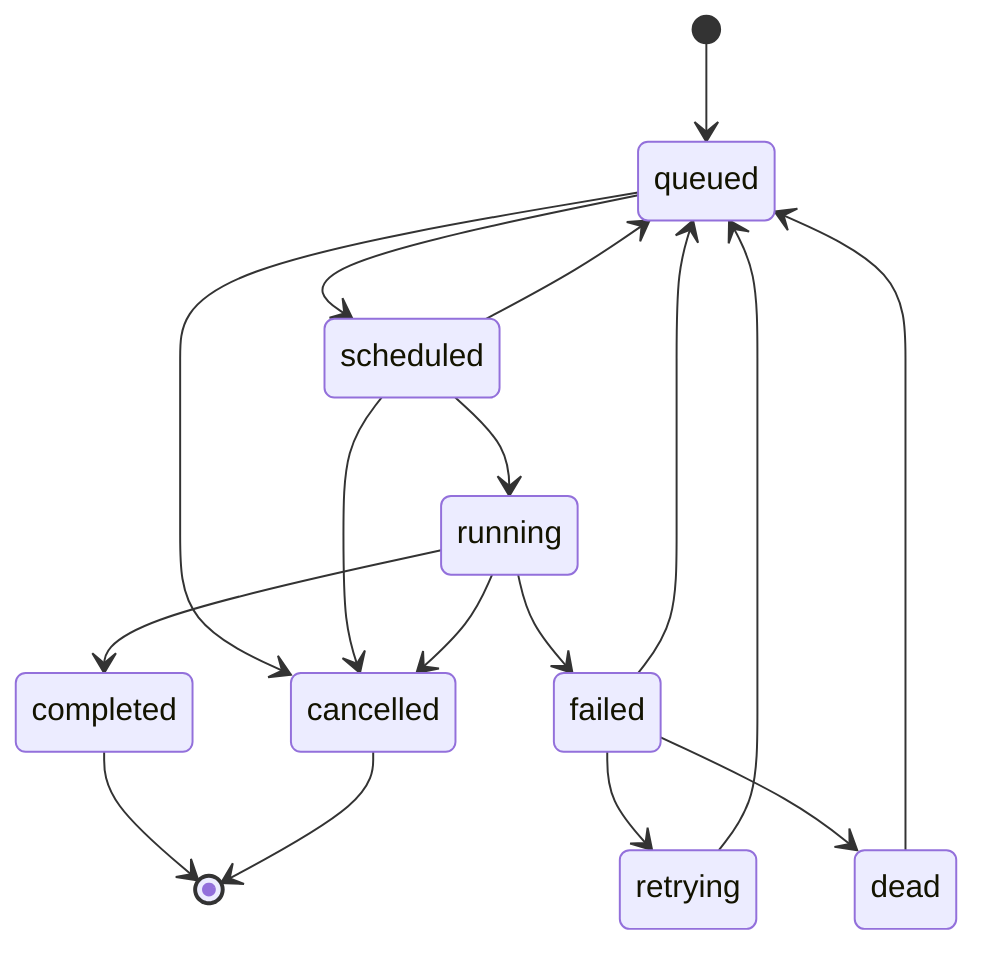
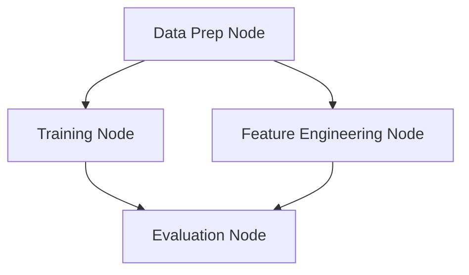

# Domain Model & DAG Specs

The domain layer (`internal/domain/`) models the primary durable entities and in-memory status rules of the Orion platform.

---

## Jobs & Execution States

A **Job** is the atomic unit of execution in Orion. It is typed as either an `inline` handler task or a `k8s_job` (Kubernetes container task).

### Job Status State Machine

Orion enforces a strict state machine to prevent race conditions during distributed runs:



### Transition Enforcements
* **Advisory Rules:** Helper functions in Go (`CanTransitionTo`, `IsTerminal`, `IsRetryable`) validate transition paths in-memory for validation.
* **Store Enforcement:** Concurrency control is strictly enforced by PostgreSQL using Compare-and-Swap (CAS) state changes (e.g. `UPDATE jobs SET status = $1 WHERE id = $2 AND status = $3`).

---

## Workers & Heartbeat Liveness

A **Worker** represents a runtime process capable of consuming execution requests from Redis Streams.

### Fields and Functions
* **State Mapping:** Workers store Hostname, Queue assignments, active concurrency limits, active execution counts, and `LastHeartbeat` timestamps.
* **Heartbeat Validity:** `IsAlive(ttl)` matches the worker's heartbeat against the system wall-clock:
  $$\text{IsAlive} = \text{LastHeartbeat} + \text{HeartbeatTTL} > \text{CurrentTime}$$
* **Orphan Reclamation:** When a worker is declared dead, its active jobs are reclaimed (reset to `queued` or set to `failed` to trigger retries) by the scheduler.

---

## Pipelines & Directed Acyclic Graphs (DAGs)

A **Pipeline** coordinates multiple dependent jobs structured as a Directed Acyclic Graph (DAG).



### DAG Specification
* **Nodes (`DAGNode`):** Represent logical execution points linked to a job template.
* **Edges (`DAGEdge`):** Define dependencies (e.g., Node B depends on Node A completing).

### Dependency Resolution (`ReadyNodes`)
Every tick, the Pipeline Advancer evaluates which nodes are ready to run based on the completion of their parent dependencies. The `ReadyNodes` algorithm computes allocations:

```go
func (spec *DAGSpec) ReadyNodes(completed map[string]bool) []string {
  // 1. Build adjacency list of dependencies
  // 2. Scan every node and verify parents are present in 'completed'
  // 3. Return unrun nodes whose dependencies are met
}
```

### Complexity Metrics

| Operation | Time Complexity | Space Complexity | Algorithm Details |
| --- | --- | --- | --- |
| `ReadyNodes` | $\mathcal{O}(V + E)$ | $\mathcal{O}(E + R)$ | Builds dependency maps and scans the node list. |
| `findNode` | $\mathcal{O}(V)$ | $\mathcal{O}(1)$ | Linear scan through the slice of graph nodes. |
| `findDownstream` | $\mathcal{O}(V + E)$ | $\mathcal{O}(V + E)$ | BFS traversal to find all children for cascade cancel. |
