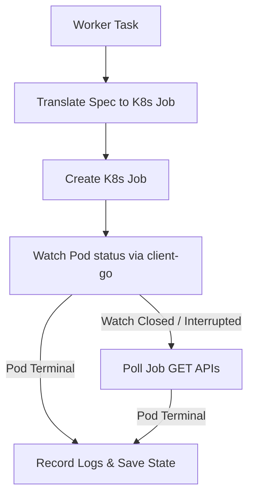

# Execution Engines

Orion supports execution pluggability via the `worker.Executor` interface. Tasks are routed to either the **Inline Executor** (in-process Go handlers) or the **Kubernetes Executor** (out-of-process container jobs).

---

## Inline Executor

The **Inline Executor** (`internal/worker/inline.go`) runs Go functions directly inside the worker process. It is used for lightweight orchestration tasks, health checks, and local testing.

* **Thread-Safe Registry:** Handlers are registered using a `map[string]HandlerFunc` protected by a `sync.RWMutex` to allow concurrent reads during high job throughput.
* **Panic Isolation:** Each execution is wrapped with a panic recovery decorator. If an inline handler panics, the worker catches the panic, converts it into a standard Go error, and transitions the job to `failed` rather than crashing the worker process.

---

## Kubernetes Executor

The **Kubernetes Executor** (`internal/worker/k8s/`) translates job descriptions into Kubernetes `batch/v1` Job manifests and manages their lifecycles.



### Spec Translation Decisions
To keep Orion in full control of execution schedules and retries, the executor enforces specific configurations in the generated Kubernetes manifests:

| Manifest Field | Configured Value | Architectural Justification |
| --- | --- | --- |
| `spec.backoffLimit` | `0` | Tells Kubernetes not to retry failed pods. Orion manages retry delays and attempt accounting. |
| `spec.template.spec.restartPolicy` | `Never` | Ensures container failures bubble up immediately to the Orion worker instead of retrying silently inside the cluster. |
| `spec.completions` / `spec.parallelism` | `1` | Runs exactly one pod per task to ensure execution isolation. |
| `resources.requests` == `resources.limits` | **Guaranteed QoS** | Setting CPU/Memory requests equal to limits grants pods a Guaranteed Quality of Service, protecting long-running ML or GPU jobs from eviction under node pressure. |
| `resources.limits["nvidia.com/gpu"]` | Custom value | Requests direct hardware acceleration from the cluster's NVIDIA device plugin. |
| `spec.ttlSecondsAfterFinished` | `86400` | Asks Kubernetes to garbage-collect completed Job records and resources after 24 hours to keep the namespace clean. |

---

## Watch with Poll Fallback

To observe Job lifecycles efficiently while resisting API server network drops, the executor implements a hybrid watch/poll pattern:

* **Primary Watch:** Opens a low-latency Kubernetes event watch restricted to the target job's metadata name selector:
  ```go
  fieldSelector := fmt.Sprintf("metadata.name=%s", jobName)
  ```
* **Fallback Polling:** If the watch channel is closed by the API server or encounters connection issues, the worker falls back to polling the Kubernetes GET API on a periodic interval. This ensures tasks are tracked to completion even during cluster API server upgrades or network blips.

---

## Cancellation & Foreground Cleanup

When a job is cancelled or hits its execution timeout limit, the executor terminates the active Kubernetes resources:

```go
deletePolicy := metav1.DeletePropagationForeground
err := client.BatchV1().Jobs(namespace).Delete(ctx, jobName, metav1.DeleteOptions{
  PropagationPolicy: &deletePolicy,
})
```

### Foreground Cascade Deletion
By specifying `DeletePropagationForeground`, the API server marks the owner Job as "deleting" and recursively deletes all child Pods before removing the Job itself. This prevents the creation of orphan pods that could consume GPU memory or compute capacity after the parent controller task has been terminated.
