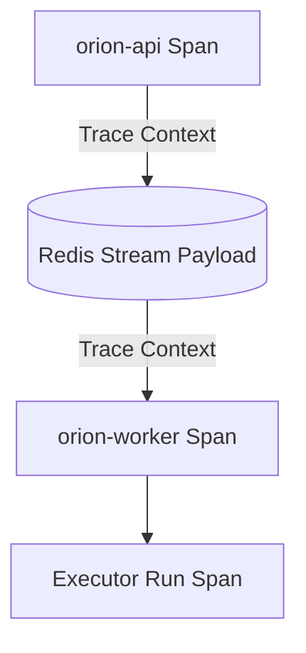
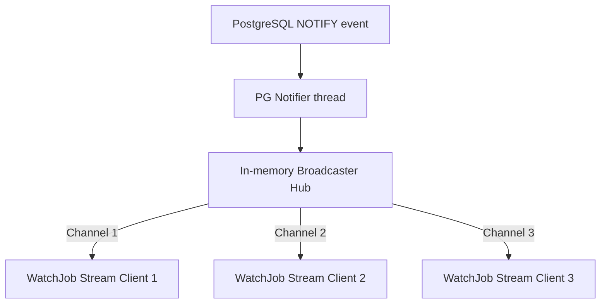

# Observability & Diagnostics

Orion incorporates observability (`internal/observability/`) as a first-class citizen, ensuring ML tasks, queues, and database states are fully observable.

---

## Prometheus Metrics

Orion exposes metrics from each active process on a dedicated scraping port. 

### Cardinality Discipline
Metrics are designed to prevent memory leaks by enforcing strict cardinality rules:
* **Allowed Labels:** Low-cardinality values such as queue names, job types, status codes, route patterns, and SQL operation names.
* **Prohibited Labels:** High-cardinality values (such as `job_id`, `pipeline_id`, or client usernames) are strictly excluded from metric labels.

### Core Metric Families

| Metric Family | Type | Monitored Behavior |
| --- | --- | --- |
| `orion_job_lifecycle_total` | Counter | Tracks total job submissions, completions, failures, retries, and transitions to dead-letter states. |
| `orion_job_duration_seconds` | Histogram | Measures execution duration percentiles by job type and queue. |
| `orion_queue_depth` | Gauge | Tracks current message backlog size per queue in Redis. |
| `orion_worker_active_jobs` | Gauge | Tracks active worker utilization counts. |
| `orion_scheduler_cycle_duration_seconds` | Histogram | Tracks the execution time of scheduler ticks (fair-queue sorts, sweeps, and promotions). |

---

## OpenTelemetry Tracing

Orion traces executions across process boundaries using OpenTelemetry:



* **HTTP Middleware:** Captures incoming web requests, generating span wrappers for REST endpoints.
* **gRPC Middleware:** Integrates `otelgrpc.NewServerHandler` to automatically trace RPC operations, including server-streaming `WatchJob` invocations.
* **Database Spans:** Generates detailed child spans for slow store operations (e.g. `TransitionJobState`, `AddPipelineJob`).
* **Distributed Propagation:** Active trace and span contexts are serialized and packed inside task queue payloads, enabling workers to link execution spans back to the parent API submit span.

---

## Structured Logging

Logs are formatted using Go's structured logger (`slog`):
* **Local Development:** Emits human-readable colorized text logs.
* **Production/Staging:** Emits structured JSON logs for ingestion by logging collectors (e.g. ELK, Grafana Loki).
* **Context Enrichment (`WithTrace`):** Log configurations automatically extract the current trace and span IDs from the context, attaching them to each log row:
  ```json
  {"time":"2026-06-22T20:15:00Z","level":"INFO","msg":"job execution started","job_id":"550e8400-e29b-41d4-a716-446655440000","trace_id":"4bf92f3577b34da6a3ce929d0e0e4736"}
  ```

---

## Real-Time gRPC Event Broadcaster

To power real-time dashboards and CLI watchers without overloading the database, Orion utilizes an in-memory event broadcaster (`internal/api/grpc/broadcaster.go`):



* **Broadcaster Hub:** Maintains a thread-safe map of active streaming channels grouped by Job ID, protected by a `sync.RWMutex`.
* **Non-Blocking Pubs:** Event dispatches use a non-blocking channel send. If a subscriber's buffer (capacity 16) is full (e.g., due to client-side network latency), the broadcaster drops the event rather than blocking the system.
* **Polling Recovery:** If a gRPC client misses an event due to a drop, the client's built-in 500 ms polling fallback automatically queries the database state to recover.
