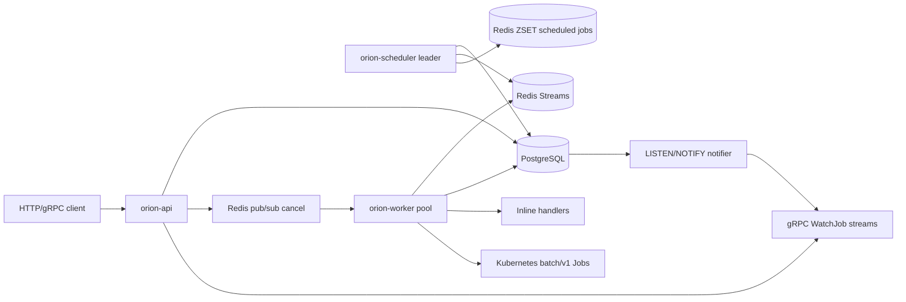
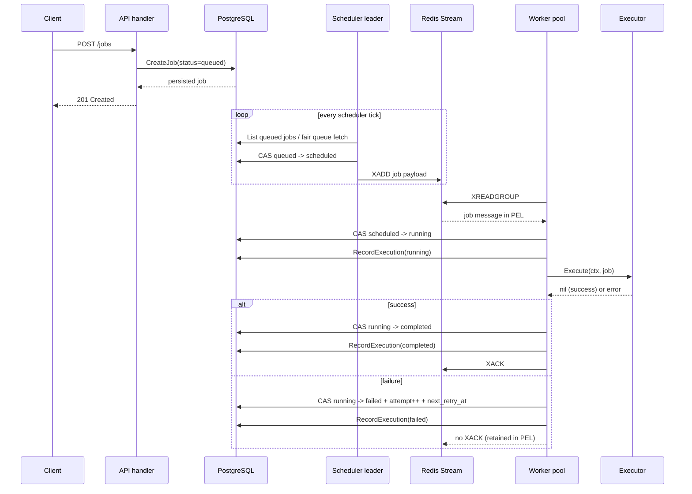
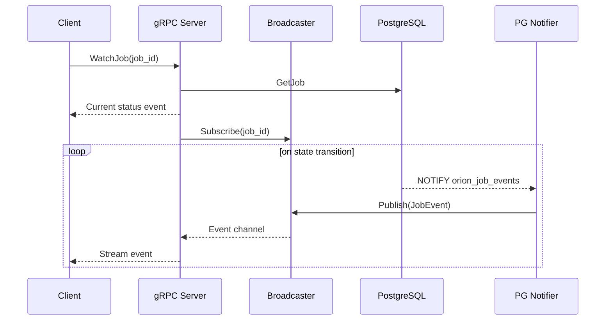

# System Overview & Topology

Orion separates **control-plane state**, **delivery**, and **execution** into distinct, decoupled subsystems.

PostgreSQL is the single source of truth. Redis is not authoritative; it is used purely as a transient delivery transport. Workers are stateless, disposable executors. The scheduler is an active/passive singleton leader that translates durable database intent into Redis delivery messages. The API tier is responsible for creating and observing this durable intent.

## Architectural Guarantees

* **Atomic Transitions:** Job state transitions are executed atomically using Compare-and-Swap (CAS) queries at the database level.
* **At-Least-Once Delivery:** Message dispatch via Redis Streams ensures at-least-once queue delivery.
* **Idempotent Execution:** Execution safety is enforced by database CAS guards, preventing duplicate runs even if messages are delivered multiple times.
* **Advisory Leader Lock:** Active/passive scheduler redundancy is managed through PostgreSQL session-level advisory locks.
* **Resilient Failovers:** If workers crash, unprocessed or active messages remain in the Redis Pending Entries List (PEL) and are safely reclaimed by the scheduler after heartbeats expire.
* **Orion-Owned Retries:** Kubernetes Job retries are disabled; Orion manages attempt counters, retry schedules, and backoffs directly.

---

## Service Topology

Orion compiles into three production Go binaries:

| Binary | Stateful? | Horizontal Scale | Main Dependencies | Primary Loop |
| --- | --- | --- | --- | --- |
| `orion-api` | No | Yes | PostgreSQL, Redis, gRPC | Request/Response + Event Streams |
| `orion-scheduler` | Logically (via lock) | Active/Passive | PostgreSQL, Redis | Ticker-based schedule and sweep loops |
| `orion-worker` | No | Yes | PostgreSQL, Redis, Kubernetes API | Bounded worker pool consuming streams |

---

## Core Workflows

### 1. End-to-End Job Submission

### 2. Real-Time Job Watching (gRPC)

