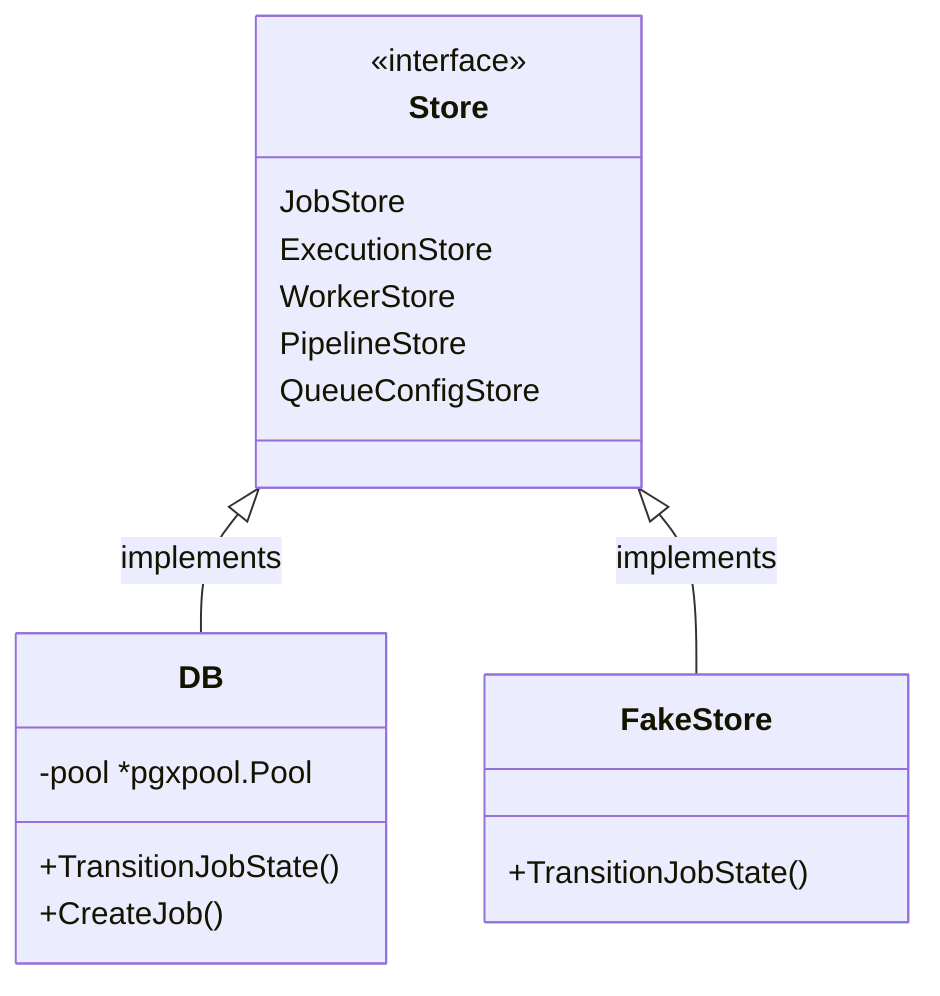

# Persistence & State Transitions

Orion adopts a database-centric model where all orchestration states, schedules, and task dependencies reside in PostgreSQL.

---

## Interface Boundaries

The persistence layer (`internal/store/`) separates interface definition from SQL implementation, enabling compile-time isolation and test mocking.



* **Dependency Inversion:** Consumers (like the scheduler or worker pool) accept the abstract `store.Store` interface rather than a direct database handle.
* **Sentinel Errors:** Errors wrap database-specific states into typed system errors (`store.ErrNotFound`, `store.ErrStateConflict`), allowing upper layers to translate errors into correct API status codes without importing SQL packages.

---

## Database Schema & Indexing

The relational layout uses specific indexing to keep dispatch queries fast and prevent table scans under high job throughput:

### Essential Indexes

| Index | Target Table / Columns | Operational Purpose |
| --- | --- | --- |
| `idx_jobs_queued_priority` | `jobs(status, priority DESC, created_at ASC)` | Allows the scheduler to scan and fetch queued jobs ordered by priority/FIFO without full table sorting. |
| `idx_jobs_retry_eligible` | `jobs(status, next_retry_at)` | Used by the retry-promoter to efficiently find failed tasks whose backoff delays have expired. |
| `idx_jobs_running_worker` | `jobs(status, worker_id)` | Scans active executions associated with a specific worker to perform orphan audits. |
| `idx_workers_heartbeat` | `workers(status, last_heartbeat)` | Scans active worker nodes and detects failed or expired heartbeats. |
| `idx_pipeline_jobs_pipeline_node` | `pipeline_jobs(pipeline_id, node_id)` | Accelerates DAG state resolution checks during JOIN queries. |

---

## State Transition Functional Options

State updates frequently require updating accessory columns (e.g. logging execution errors, setting starting time, recording completion timestamps). Orion handles this using a Go functional-options pattern:

```go
// Transition a job status while writing additional metrics
err := store.TransitionJobState(ctx, jobID, domain.JobStatusRunning,
  store.WithWorkerID(workerID),
  store.WithStartedAt(time.Now()),
)
```

### PostgreSQL CAS (Compare-and-Swap)
Under the hood, the PostgreSQL store dynamically compiles the update query to include the options while executing a strict state check:

```sql
UPDATE jobs 
SET status = $1, worker_id = $2, started_at = $3, updated_at = NOW() 
WHERE id = $4 AND status = $5;
```

If the row status has changed in the background (e.g. a worker cancelled the job), the query updates zero rows, and the store returns `store.ErrStateConflict`. This protects the system from double executions and state corruption.
