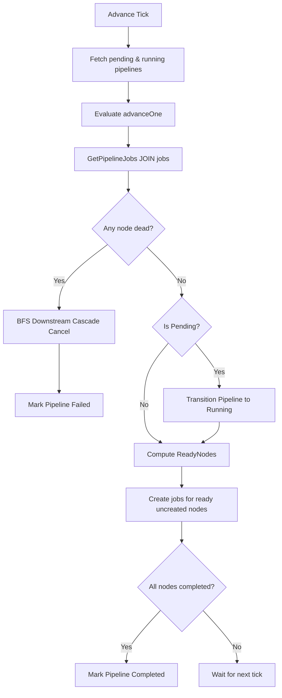
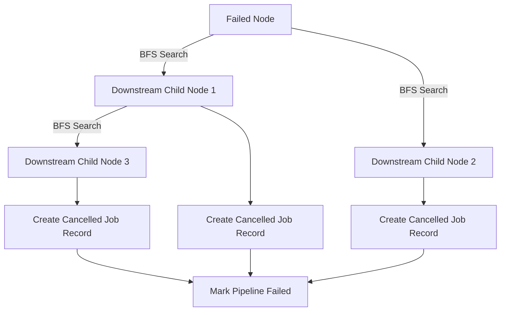

# Pipeline Advancer & DAG Engine

The Pipeline Advancer (`internal/pipeline/`) coordinates the execution of Directed Acyclic Graphs (DAGs) representing complex pipelines. It runs as a stateless evaluator invoked by the scheduler leader on every tick.

---

## The Advancement Loop

Every scheduler tick, the advancer evaluates all pipelines currently marked as `pending` or `running`:

1. **Load Current State:** Performs a SQL `JOIN` on `pipeline_jobs` and `jobs` to construct the active completion map of the pipeline's nodes.
2. **First Touch:** If the pipeline status is `pending`, it transitions the status to `running`.
3. **Resolve Ready Nodes:** Evaluates the DAG dependencies against the completion map. For each ready node that has not yet spawned a job, the advancer creates a new job record in the database.
4. **Completion Check:** If all nodes in the DAG have successfully transitioned to `completed`, the advancer marks the pipeline as `completed`.

---

## Cascade Cancellation

If any node in the pipeline fails permanently and reaches a `dead` status (depleting all retries), the advancer aborts all downstream tasks that depend on it:

1. **Detect Failure:** Scans the active job nodes. If any node is in a `dead` state, it triggers a cascade cancel.
2. **Breadth-First Search (BFS):** Traverses downstream edges starting from the failed node to identify all dependent nodes.
3. **Cancel Tasks:** For each downstream node, the advancer creates a job record in the database pre-set to `cancelled` and links it to the pipeline. This ensures a clean audit log and prevents orphans.
4. **Fail Pipeline:** Sets the pipeline status to `failed`.

---

## Idempotence & Safety

Because multiple nodes run concurrently and the scheduler leader can fail over at any time, the advancer is designed to be fully idempotent:

* **In-Memory Tracking:** The advancer tracks already-spawned nodes using a `createdNodes` map during the tick.
* **Store Integrity:** Linking jobs to the pipeline via `AddPipelineJob` uses an `ON CONFLICT DO NOTHING` SQL check, preventing duplicate links if a scheduler crash occurs midway through spawning.
