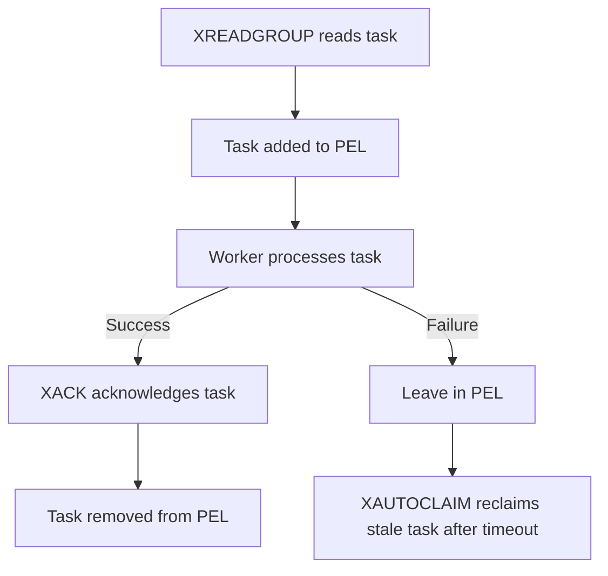

# Queue & Message Delivery

Orion uses Redis (`internal/queue/redis`) as a high-throughput, low-latency transient transport layer to deliver scheduled jobs from the control plane to worker pools.

---

## Streams & Consumer Groups

Tasks are categorized into four distinct Redis Streams:
* `orion:queue:high`
* `orion:queue:default`
* `orion:queue:low`
* `orion:queue:dead` (dead-letter queue)

### Lazy Group Creation
When the queue service starts, it calls `XGroupCreateMkStream` to register the consumer group `orion-workers` for the active streams, creating the stream key automatically if it does not yet exist.

### Dequeue Consumption
Worker pools fetch tasks using `XREADGROUP` under the following parameters:
* **Group:** `"orion-workers"`
* **Consumer:** Unique worker ID
* **Streams:** `[stream_name, ">"]` (where `>` reads only new, unassigned messages)
* **Count:** `1` (processes tasks one by one to support precise backpressure)
* **Block:** `5s` (blocks the connection for up to 5 seconds if no messages are available)
* **NoAck:** `false` (retains the message in the Pending Entries List until explicitly acknowledged)

---

## Pending Entries List (PEL) & Reclaims

To ensure at-least-once delivery, read messages are not removed from Redis immediately. Instead, they are placed in the **Pending Entries List (PEL)** of the consumer group.



### Acknowledgement Semantics
* **Successful Run:** The worker calls `XACK`, removing the task from the PEL.
* **Failure Run:** The worker intentionally does not call `XACK`. The message remains in the PEL.
* **XAUTOCLAIM Recovery:** A background process periodically scans the PEL using `XAUTOCLAIM` for each stream. If a message is stuck in the PEL for longer than the timeout limit (due to worker crash), the reclaimer re-publishes the payload via `XADD` and marks the old message as acknowledged.

---

## Future-Scheduled ZSET Queue

Jobs scheduled to run in the future (e.g. cron-like triggers or delayed retries) are not placed directly in streams. Instead, they are stored in a Redis Sorted Set (`orion:queue:scheduled`).

* **Scores:** Members are scored by their scheduled Unix timestamps (`scheduled_at.Unix()`).
* **Sweeper Loop:** The scheduler leader polls this ZSET every second.
* **Atomic lua Sweep:** To prevent race conditions if multiple schedulers attempt to sweep concurrently, Orion uses an atomic Lua script to pop expired members:
  ```lua
  local members = redis.call('zrangebyscore', KEYS[1], '-inf', ARGV[1])
  if #members > 0 then
    redis.call('zrem', KEYS[1], unpack(members))
  end
  return members
  ```
   Popped jobs are then enqueued into their respective target streams.
