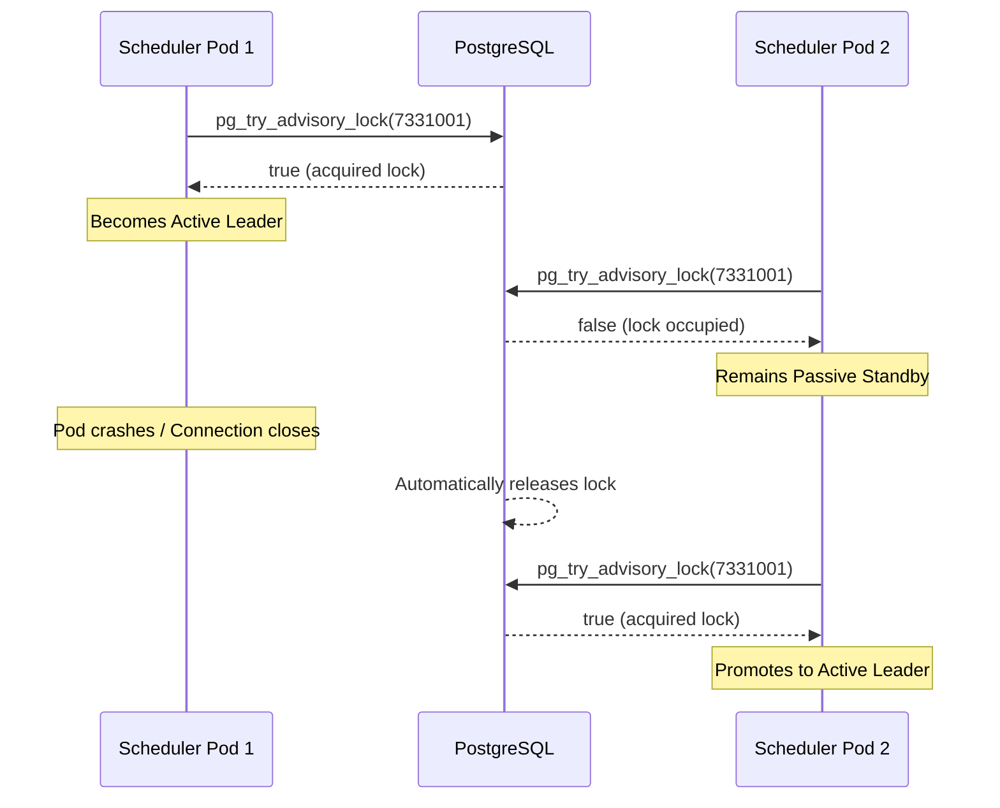
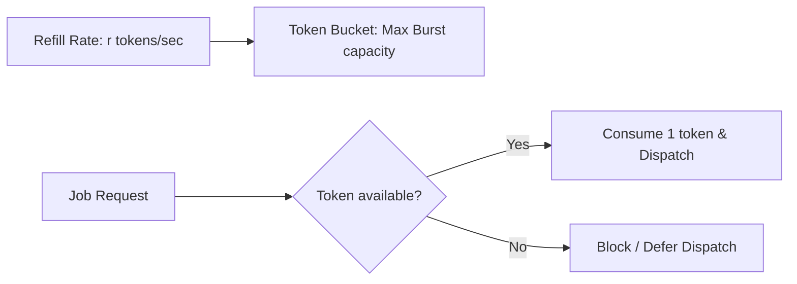

# Scheduler & Dispatch Loops

The scheduler (`internal/scheduler/`) acts as Orion's control plane. It runs as a logically singleton coordinator responsible for moving jobs from state queues to execution streams.

---

## Leader Election via Advisory Locks

Orion enforces active/passive scheduler redundancy using PostgreSQL Session-Level Advisory Locks.

### Dedicated Connection Pinning
Advisory locks in Postgres are bound to the database session (the TCP connection). Because `pgxpool` dynamically borrows and rotates connections, executing the lock query inside standard pool requests would risk releasing the lock prematurely if the pool swaps the connection. 

Orion pins leadership to a single dedicated connection (`pgxpool.Conn`) checked out for the lifetime of the leader process. If the leader fails or disconnects, PostgreSQL automatically releases the lock.

---

## Scheduler Loops & Tickers

The active leader runs a single-threaded ticker loop that executes the following routines:

* **Job Dispatcher (`scheduleQueuedJobs`):** Fetches pending jobs, allocates them to queues, and publishes execution payloads to Redis Streams.
* **Retry Promoter (`promoteRetryableJobs`):** Finds failed jobs whose retry wait timers have expired and re-queues them.
* **Pipeline Advancer (`AdvanceAll`):** Updates DAG pipeline structures and spawns new ready nodes.
* **Orphan Reclaimer (`reclaimOrphanedJobs` - runs on a longer interval):** Finds tasks running on workers that have missed their heartbeats and resets them to clean states.

---

## Weighted Fair Dispatch

To prevent high-volume users or queues from starving other workloads, the scheduler implements a **Weighted Fair Dispatch** allocator (`fairqueue.go`).

Every dispatch tick, the scheduler distributes the total batch size across active queues according to their configuration weights:

$$\text{Allocation} = \text{BatchSize} \times \left( \frac{\text{QueueWeight}}{\sum \text{Weights}} \right)$$

1. **Sort Queues:** Queues are sorted in descending order of their current configured weights.
2. **Assign Allocations:** Each queue is allocated its proportional slice.
3. **Capacity Flow:** If a queue has fewer ready jobs than its allocated slots, the unused allocation capacity flows down to the next queue in the sorted list.

---

## Token Bucket Rate Limiter

To enforce rate limits and avoid overloading downstream workers, each queue is governed by a **Token Bucket Rate Limiter** (`ratelimiter.go`):

* **State Variables:** `tokens` (current count), `maxTokens` (burst capacity), and `refillRate` (tokens added per second).
* **Lazy Evaluation:** Instead of running timers to refill buckets continually, the limiter updates the token counts lazily on every request by checking the elapsed time since the last refill:
  $$\text{tokens}_{\text{new}} = \min(\text{maxTokens}, \text{tokens}_{\text{old}} + \Delta t \times \text{refillRate})$$

---

## Retry Promotion & Backoff Jitter

Failed tasks with remaining attempts are rescheduled with exponential backoff and randomized jitter to prevent "thundering herd" conditions on external services:

$$\text{Backoff} = \min\left(\text{Cap}, \text{Base} \times 2^{\text{attempt}}\right)$$

$$\text{JitteredDelay} = \text{Random}([0, \text{Backoff}])$$

Orion uses **Full Jitter** (`pkg/retry/`), which draws the delay uniformly from $0$ to the calculated exponential backoff limit, dampening peak load spikes after shared system outages.
