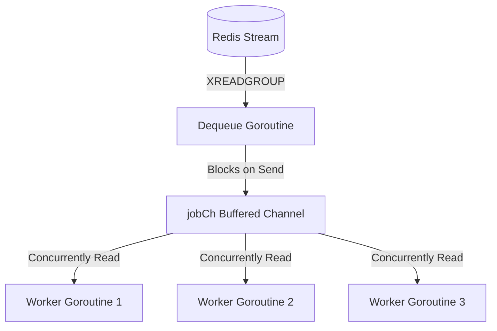
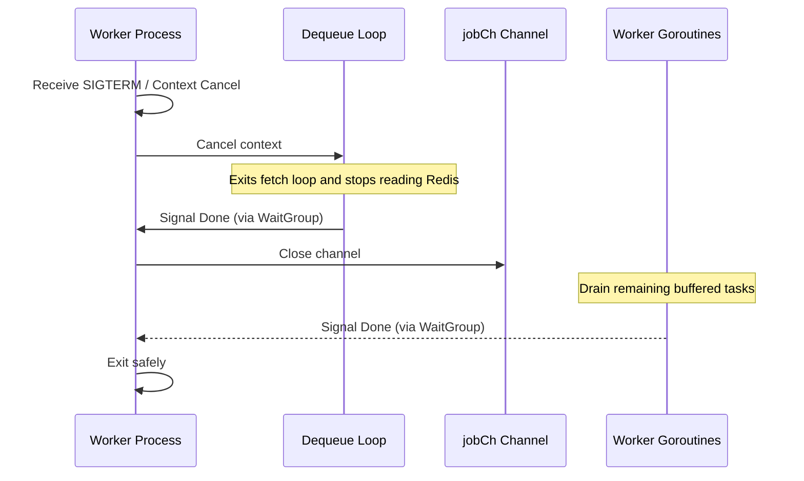
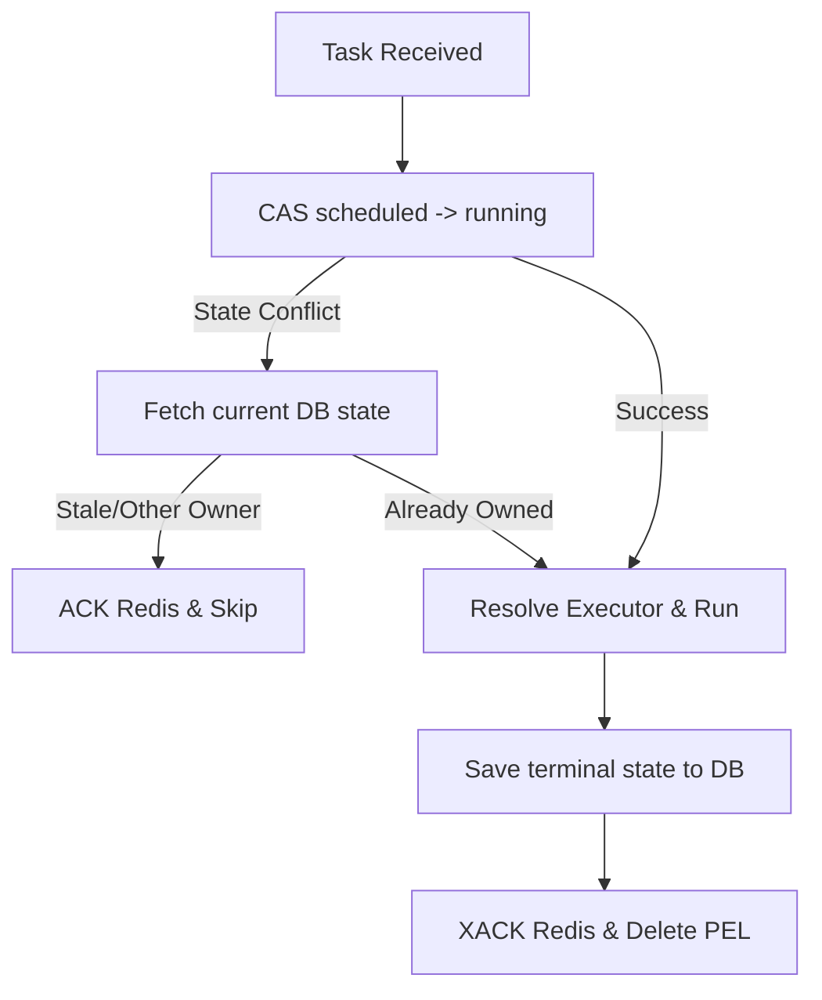

# Worker Pool & Concurrency

Orion workers (`internal/worker/`) run as stateless processes that fetch task payloads from Redis Streams and execute them inside concurrent worker pools.

---

## Dequeue Loops & Channel Backpressure

To prevent workers from consuming more tasks than they have CPU or memory capacity to run, Orion implements a **Buffered Channel Backpressure** model.



### Flow Mechanics
1. **Queue Buffer:** For each queue, a single dequeue goroutine calls `XREADGROUP` to fetch jobs.
2. **Channel Buffer:** Fetched jobs are dispatched to `jobCh`, a buffered channel of size equal to the worker pool's concurrency limit:
   ```go
   jobCh := make(chan *jobTask, cfg.Concurrency)
   ```
3. **Backpressure Enforced:** When all worker goroutines are busy and the channel buffer is full, the dequeue goroutine blocks on sending to `jobCh`. It stops fetching new messages from Redis, ensuring unprocessed messages remain in the stream broker rather than loading into process memory.

---

## Concurrency Primitives

Orion's worker engine uses specific Go concurrency primitives to manage safety, synchronization, and state updates:

| Primitive | Purpose | Implementation details |
| --- | --- | --- |
| **Buffered Channel** | Flow control & task handoff | Blocks the dequeue loop when workers are fully occupied. |
| **sync.WaitGroup** | Graceful shutdown synchronization | Ensures the dequeue loop exits before closing channels, and tracks active executions. |
| **atomic.Int32** | Lock-free counters | Tracks active task counts exposed to Prometheus metrics without lock contention. |
| **sync.Mutex** | Thread-safe maps | Protects the active job cancellation map, associating active job IDs with cancel contexts. |
| **context.Context** | Propagation and timeouts | Propagates cancellations, task deadlines, and shutdown triggers throughout the call stack. |

---

## Graceful Shutdown Flow

To prevent job corruption or termination of running tasks during redeployments, the worker pool executes a phased shutdown:



1. **Stop Dequeue:** The context cancellation terminates the dequeue loops immediately.
2. **Draining:** The main thread waits for the dequeue loops to exit, then closes `jobCh`. Closing the channel tells the worker goroutines to exit once they finish processing the remaining buffered jobs.
3. **Timeout Limit:** The process blocks until all active worker goroutines exit, or until a hard `ShutdownTimeout` expires.

---

## Task Execution State Machine

Each task processed by a worker undergoes a strict validation and cleanup cycle:



1. **CAS Mark Running:** The worker attempts to set the job status from `scheduled` to `running` in PostgreSQL.
2. **Conflict Resolution:** If a database state conflict occurs (e.g., due to duplicate delivery or scheduler recovery), the worker fetches the current database record:
   * If another worker owns the job, the local worker skips execution and ACKs the message.
   * If the job has already finished, the local worker ACKs the message and skips.
   * If this worker already owns the job (e.g., after a worker process restart), it proceeds to execute.
3. **Execute:** Resolves the executor (Inline or Kubernetes), wraps the execution in a deadline context, and calls `Execute`.
4. **Terminal Update:** Saves the outcome (`completed` or `failed`) and the attempt counter in PostgreSQL.
5. **Acknowledge:** On success, the worker acknowledges the stream message using `XACK`. On failure, it leaves the message in the PEL, allowing the scheduler to reclaim it after a retry delay.
