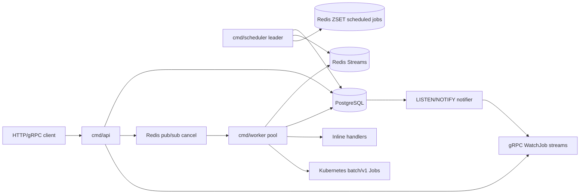
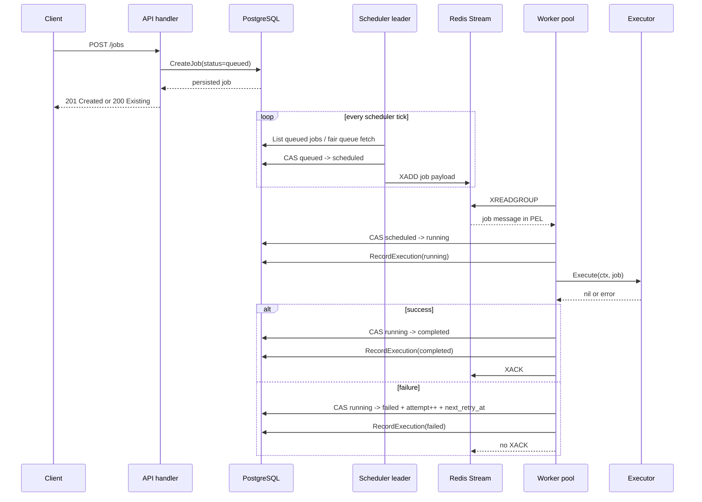
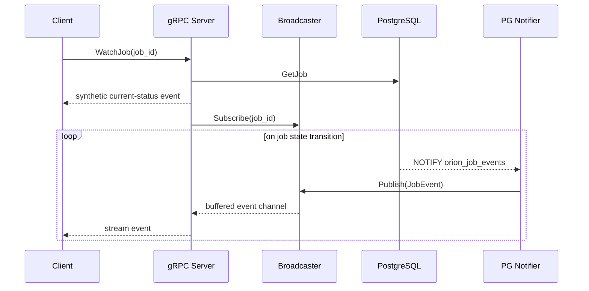
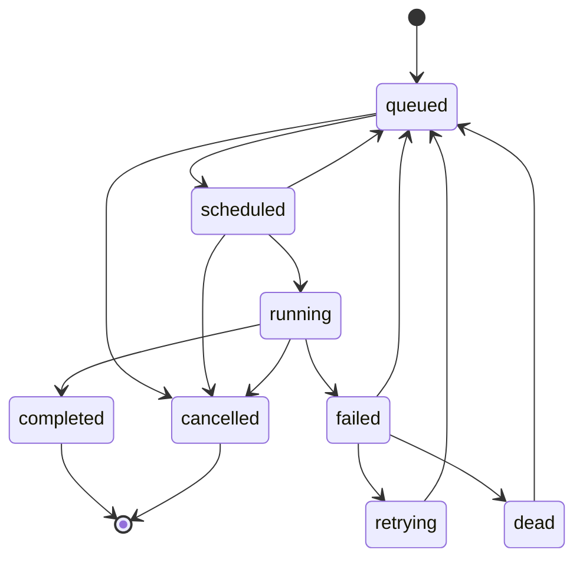
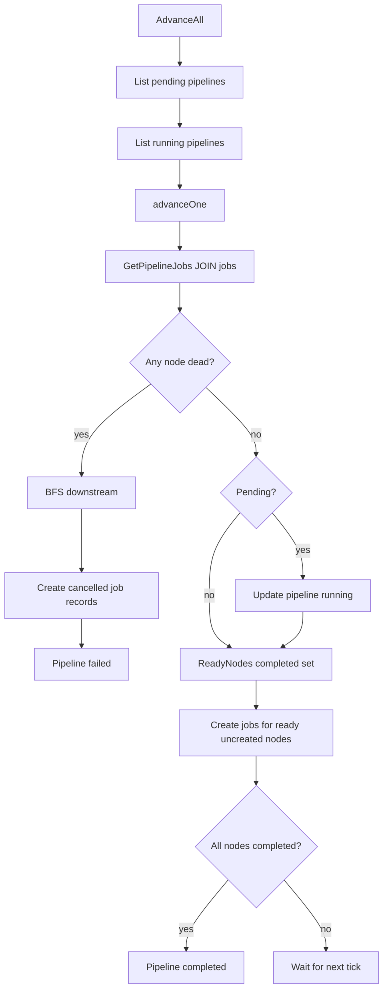

# Orion Repository Reverse-Engineering Reference

This document reverse engineers the Orion repository as a distributed systems
textbook. It is grounded in the code currently present in the workspace and is
intended to help an engineer understand, operate, extend, or reimplement the
system from first principles.

Orion is a Go-based machine-learning job orchestrator. It exposes HTTP and gRPC
APIs, persists canonical state in PostgreSQL, dispatches executable work through
Redis Streams, and can execute jobs either inline inside a worker process or as
Kubernetes `batch/v1` Jobs. It also contains a Next.js dashboard, Helm/Kubernetes
deployment manifests, Prometheus rules, and extensive unit/integration tests.

Generated protobuf files and frontend build/dependency output are intentionally
not treated as authored source. The hand-authored source of truth is:

- Go services: `cmd/`, `internal/`, `pkg/`
- API schema: `proto/orion/v1/jobs.proto`
- SQL schema: `internal/store/migrations/`
- Deployment: `deploy/`, `docker-compose.yml`, `Makefile`
- Frontend: `frontend/app`, `frontend/components`, `frontend/lib`, frontend config
- Design history: `docs/adr/`, `docs/phases/`, `README.md`, `RUNBOOK.md`

## System Thesis

Orion separates **control-plane state**, **delivery**, and **execution**.

PostgreSQL is the source of truth. Redis is not authoritative; it is a delivery
transport. Workers are disposable executors. The scheduler is a singleton leader
that converts durable DB intent into Redis delivery messages. The API tier
creates and observes durable intent. This separation is the central design choice
behind almost every package.



The resulting guarantees are deliberately modest and practical:

- Job state transitions are atomic at PostgreSQL level.
- Queue delivery is at-least-once.
- Execution is made idempotent by database compare-and-swap guards, not by Redis.
- The scheduler is active/passive through PostgreSQL advisory locks.
- Workers can crash and messages remain recoverable through Redis Pending Entries
  Lists plus database orphan reclamation.
- Kubernetes retries are disabled so Orion, not Kubernetes, owns attempts and
  retry accounting.

## Repository Map

| Path | Role |
| --- | --- |
| `cmd/api` | HTTP API, gRPC API, metrics/tracing setup, PostgreSQL/Redis wiring |
| `cmd/scheduler` | Leader-elected dispatch loop, retry promotion, DAG advancement |
| `cmd/worker` | Worker pool wiring, inline handlers, Kubernetes executor wiring |
| `internal/domain` | Domain entities and in-memory state-machine helpers |
| `internal/store` | Persistence interfaces, filters, typed errors, transition options |
| `internal/store/postgres` | PostgreSQL implementation and SQL access patterns |
| `internal/queue` | Broker abstraction |
| `internal/queue/redis` | Redis Streams, scheduled ZSET, PEL reclaim, queue depth polling |
| `internal/scheduler` | Advisory-lock scheduler, token buckets, weighted fair queueing |
| `internal/pipeline` | DAG advancement and cascade cancellation |
| `internal/worker` | Bounded goroutine pool, executor interface, inline executor |
| `internal/worker/k8s` | Kubernetes Job translation, client-go watch/poll execution |
| `internal/worker/cancel` | Redis pub/sub cancellation signaler |
| `internal/api/handler` | REST handlers and HTTP middleware |
| `internal/api/grpc` | gRPC service, in-memory event broadcaster, PG notifier |
| `internal/observability` | Prometheus metrics, OpenTelemetry tracing, slog setup |
| `pkg/retry` | Generic retry/backoff utilities |
| `proto/orion/v1/jobs.proto` | gRPC service and protobuf message schema |
| `frontend` | Next.js operational dashboard using mock/API-shaped data |
| `deploy` | Dockerfiles, Helm chart, raw Kubernetes RBAC/job manifests, Prometheus |

## Execution Topology

There are three production Go binaries.

| Binary | Stateful? | Horizontal scale | Main dependencies | Primary loop |
| --- | --- | --- | --- | --- |
| `orion-api` | No | Yes | PostgreSQL, Redis, gRPC | request/response plus streaming |
| `orion-scheduler` | Logically singleton | Many replicas, one leader | PostgreSQL, Redis | ticker-based scheduling |
| `orion-worker` | No durable local state | Yes | PostgreSQL, Redis, Kubernetes API | bounded worker pool |

The API and workers can scale horizontally because all durable state lives in
PostgreSQL. Scheduler pods can also scale horizontally, but only one should
dispatch at a time. `internal/scheduler/scheduler.go` uses
`pg_try_advisory_lock(7331001)` on a dedicated `pgxpool.Conn` so leadership is
bound to a PostgreSQL session and released automatically on process crash or
connection close.

## Request And Work Flow

### HTTP Job Submission To Completion



The failure path intentionally does not acknowledge Redis. That preserves
at-least-once delivery in Redis, but the database state machine prevents stale or
duplicate messages from causing double execution.

### gRPC WatchJob Flow



`WatchJob` also has a 500 ms polling fallback in
`internal/api/grpc/server.go`. That fallback makes event delivery resilient to
missed broadcaster events or PostgreSQL notification downtime, at the cost of
some DB reads per active stream.

## Domain Model

### Jobs

`internal/domain/job.go` defines:

- `JobStatus`: `queued`, `scheduled`, `running`, `completed`, `failed`,
  `retrying`, `dead`, `cancelled`.
- `ValidTransitions`: a map from current status to permitted next statuses.
- `JobType`: `inline` or `k8s_job`.
- `JobPriority`: integer-like `int8` priority constants.
- `Job`: the central durable work unit.
- `JobPayload`: either inline handler name/args or a `KubernetesSpec`.
- `KubernetesSpec`: image, command, args, namespace, resources, env vars,
  service account, TTL.
- `ResourceRequest`: CPU, memory, GPU request.
- `JobExecution`: immutable audit row per attempt.

The in-memory `CanTransitionTo`, `IsTerminal`, and `IsRetryable` helpers are
advisory convenience checks. The actual concurrency control is in PostgreSQL via
`TransitionJobState`, because only the database sees all concurrent actors.



Tradeoff: a Go map of valid transitions is simple and readable, but not
database-enforced. PostgreSQL has a status check constraint, not a transition
constraint. This is acceptable because all writes route through the store API in
normal code. A stricter alternative would be a database trigger that validates
state transitions, but that would move business logic into SQL and make tests
and migrations heavier.

### Workers

`internal/domain/worker.go` models worker liveness and capacity. `Worker` has
ID, hostname, queue names, concurrency, active jobs, status, heartbeat, and
registration time. `IsAlive(ttl)` compares `LastHeartbeat` with wall-clock time.
`AvailableSlots()` clamps negative capacity to zero.

The durable worker table is used for:

- liveness checks in `GET /workers`
- orphan reclamation in the scheduler
- operational visibility

The code does not currently keep `workers.active_jobs` continuously in sync with
the worker pool's atomic counter; active count is mainly exposed through
Prometheus. The table uses heartbeats and registration status for liveness.

### Pipelines And DAGs

`internal/domain/pipeline.go` defines:

- `PipelineStatus`: `pending`, `running`, `completed`, `failed`, `cancelled`
- `Pipeline`: name, status, DAG spec, timestamps
- `DAGSpec`: adjacency-list graph as `Nodes []DAGNode` and `Edges []DAGEdge`
- `DAGNode`: logical node ID, job template, optional created Job ID
- `DAGEdge`: source and target, where target depends on source
- `ReadyNodes(completed map[string]bool) []string`

`ReadyNodes` builds a dependency map from edges, then scans every node and
returns nodes whose dependencies are all present in `completed`.

Complexity:

| Function | Time | Space | Why |
| --- | --- | --- | --- |
| `DAGSpec.ReadyNodes` | `O(V + E)` | `O(E + R)` | builds dependencies then scans nodes |
| `findNode` | `O(V)` | `O(1)` | linear search through node slice |
| `findDownstream` | `O(V + E)` | `O(V + E)` | BFS over adjacency list |
| `allNodesCompleted` | `O(V)` | `O(1)` | checks each DAG node |

The code validates node uniqueness, backend presence, edge references, and
self-loops in `internal/api/handler/pipeline.go`. It does **not** currently
perform a full cycle-detection DFS. A cycle would cause no nodes in the cycle to
become ready, leaving a pipeline stuck in `running`. A topological validation
pass would close that gap.

## Persistence Layer

### Interface Boundaries

`internal/store/store.go` is pure contracts and shared types. It defines:

- `JobStore`
- `ExecutionStore`
- `WorkerStore`
- `PipelineStore`
- `QueueConfigStore`
- composite `Store`
- filters
- functional transition options
- typed sentinel errors

The design pattern is interface segregation plus dependency inversion. The
scheduler, API, worker pool, and pipeline advancer depend on `store.Store`, not
on PostgreSQL. PostgreSQL is isolated in `internal/store/postgres`.

Alternatives:

- Direct `*postgres.DB` injection would reduce interface maintenance but make
  tests and future persistence backends harder.
- Smaller interfaces per consumer would be even more precise, but the repository
  already uses a single broad fake in tests. That is easy to understand but can
  force test fakes to implement methods they do not use.

### Typed Errors

`StoreError` implements `Error()` and `Is(target error) bool`. This allows
`errors.Is(err, store.ErrNotFound)` even when the returned error has a detailed
message. This is preferable to string matching and lets handlers map store
outcomes to HTTP/gRPC status codes.

### Functional Options

`TransitionOption` mutates a `TransitionUpdateExported` struct. Callers pass
`WithWorkerID`, `WithError`, `WithNextRetryAt`, `WithStartedAt`, or
`WithCompletedAt` to atomically update extra columns while changing state.

This is a classic Go functional-options pattern. It avoids a long method
signature with many optional pointer fields. The tradeoff is dynamic SQL
construction in the PostgreSQL implementation.

## PostgreSQL Implementation

`internal/store/postgres/db.go` and `pipeline.go` implement the `Store`
interface with `pgx/v5` and `pgxpool`.

### Core SQL Schema

`001_initial_schema.up.sql` creates:

- `jobs`
- `job_executions`
- `workers`
- `pipelines`
- `pipeline_jobs`
- `update_updated_at()` trigger

Important indexes:

| Index | Purpose |
| --- | --- |
| `idx_jobs_queued_priority` | scheduler scans only queued jobs ordered by priority/FIFO |
| `idx_jobs_retry_eligible` | scheduler finds failed jobs whose backoff expired |
| `idx_jobs_running_worker` | orphan detection |
| `idx_jobs_queue_status` | filtered API list queries |
| `idx_executions_job_id` | execution history by job |
| `idx_workers_heartbeat` | active worker list and orphan decisions |
| `idx_pipelines_status_created` | scheduler active-pipeline query |
| `idx_pipeline_jobs_pipeline_node` | node status JOIN ordered by node ID |
| `idx_queue_config_enabled` | active queue config scans |

### Idempotent Job Creation

`CreateJob` handles idempotency with a client-provided `idempotency_key`.

Flow:

1. If a key exists, query by key first.
2. If found, return the existing job.
3. If missing, insert.
4. If insert hits PostgreSQL unique violation `23505`, fetch by key again.

This is robust to concurrent identical submissions because the unique index is
the serialization point. A pure Go mutex would fail across API replicas.

### Compare-And-Swap State Transitions

`TransitionJobState` is the most important persistence primitive:

```sql
UPDATE jobs
SET status = $3, ...
WHERE id = $1 AND status = $2
RETURNING id, name, COALESCE(worker_id, '')
```

If no row returns, the expected status was stale, and callers receive
`store.ErrStateConflict`. This is optimistic concurrency control. It avoids
distributed locks while making duplicate queue messages safe.

Tradeoffs:

- CAS is simple and scalable for single-row state machines.
- It requires every state writer to know the expected previous state.
- It does not protect multi-row invariants unless wrapped in transactions.
- It makes stale Redis messages cheap to discard.

### PostgreSQL LISTEN/NOTIFY

After a successful transition, `TransitionJobState` calls
`pg_notify('orion_job_events', payload)`. The API's gRPC notifier listens on a
dedicated connection because `LISTEN` is session-scoped.

This is best-effort: a notification failure does not roll back the already
committed state change. The gRPC watch layer compensates with polling fallback.

### ClaimPendingJobs

`ClaimPendingJobs` uses `SELECT ... FOR UPDATE SKIP LOCKED` inside a CTE and
then updates claimed rows to `scheduled`.

This is a PostgreSQL work-distribution pattern:

- `FOR UPDATE` locks candidate rows.
- `SKIP LOCKED` makes concurrent claimers skip rows already locked instead of
  blocking.
- The CTE plus `UPDATE ... RETURNING` claims and fetches in one statement.

In the current architecture, the scheduler usually owns dispatch through Redis,
so this method is more relevant to earlier phases/tests or possible direct DB
worker claiming. The Redis worker path marks `scheduled -> running` after
dequeue.

### Orphan Reclamation

`ReclaimOrphanedJobs` resets `running` jobs to `queued` when their worker record
is missing or heartbeat is stale. This is the database-level recovery mechanism
for a worker that died after a job entered `running`.

This complements Redis PEL recovery. Redis knows about messages; PostgreSQL
knows about job ownership and status. Both are needed because a crash can happen
at many points in the flow.

### Execution Audit

`RecordExecution` inserts into `job_executions` with
`ON CONFLICT (job_id, attempt) DO NOTHING`. The table is append-only by design.

Tradeoff: immutable audit rows preserve history, but duplicate attempt numbers
are ignored. If callers record a `running` row and later a `failed` row for the
same attempt, the unique constraint can prevent both from being stored depending
on attempt numbering. The intended model is one row per attempt, but the worker
currently records start and finish as separate calls with the same attempt. Tests
should be consulted before relying on both start and terminal rows appearing.

### JSONB Payloads

`jobs.payload` and `pipelines.dag_spec` are JSONB. Go marshals/unmarshals
`domain.JobPayload` and `domain.DAGSpec`.

This is appropriate for ML workloads where payload shape evolves often. The
tradeoff is weaker database-level validation. The code validates at API edges and
executor edges instead of through relational schema.

## Redis Queue Implementation

`internal/queue/queue.go` defines the broker interface. `internal/queue/redis`
implements it with Redis Streams.

### Streams And Consumer Groups

Known stream keys:

- `orion:queue:high`
- `orion:queue:default`
- `orion:queue:low`
- `orion:queue:dead`
- `orion:queue:scheduled` as a sorted set, not a stream

`RedisQueue.New` ensures the consumer group `orion-workers` exists for high,
default, and low streams. `XGroupCreateMkStream` creates streams lazily.

`Dequeue` uses `XREADGROUP` with:

- `Group: "orion-workers"`
- stable `Consumer: consumerID`
- `Streams: []string{streamName, ">"}`
- `Count: 1`
- `Block: 5s`
- `NoAck: false`

The message is then in the Redis Pending Entries List until `AckFunc(nil)` calls
`XACK`.

### Ack Function Semantics

`AckFunc(nil)` acknowledges and removes the message from the PEL.
`AckFunc(nonNil)` intentionally does not acknowledge. The message remains
pending and can later be reclaimed.

This implements at-least-once delivery. The worker and store CAS logic are what
make duplicate delivery tolerable.

### PEL Reclaim

`ReclaimStalePending` periodically calls `XAUTOCLAIM` for each known stream.
Claimed messages are re-added to the stream with `XADD`, then the old pending
IDs are acknowledged. This avoids permanent accumulation under the `"reclaimer"`
consumer.

Complexity per sweep is `O(Q * C)`, where `Q` is number of queues and `C` is the
claim count cap, currently 100.

### Scheduled Jobs

Future-scheduled jobs are stored in Redis sorted set `orion:queue:scheduled`
using `scheduled_at.Unix()` as score. `StartScheduledSweeper` runs every second.
`sweepScheduled` uses a Lua script to atomically:

1. `ZRANGEBYSCORE` due members
2. `ZREM` those members
3. return popped members

Atomic pop matters if multiple sweepers accidentally run. The scheduler leader
contract says only the leader should run it, but the Lua script is an extra
safety layer.

### Queue Name Mapping

`streamForQueue` only maps exact full queue constants for high and low; all
other names map to default. This is conservative but surprising when callers use
logical names like `"high"` or `"default"`. API comments mention logical names,
while code often stores full Redis keys such as `orion:queue:high`. Contributors
should normalize queue names explicitly before extending queue APIs.

## Scheduler

`internal/scheduler/scheduler.go` is the control-plane loop.

### Leader Election

The scheduler contends for a PostgreSQL advisory lock:

```sql
SELECT pg_try_advisory_lock(7331001)
```

It uses a dedicated `pgxpool.Conn` because advisory locks are session-scoped.
Using an ordinary pooled query could silently release the lock when pgxpool
rotates a connection.

Alternatives:

- Kubernetes Lease leader election: ideal for K8s-only deployments, but ties
  scheduler liveness to the Kubernetes API.
- Redis lock: possible but less attractive because Redis is not the source of
  truth.
- etcd/ZooKeeper: stronger coordination but operationally heavier.

The design also has a second safety layer: even if two schedulers dispatch, CAS
guards on `queued -> scheduled` prevent double state transition.

### Scheduler Tick Work

Every schedule tick:

1. `scheduleQueuedJobs`
2. `promoteRetryableJobs`
3. `advancer.AdvanceAll`

Every orphan tick:

1. `reclaimOrphanedJobs`

The scheduler's main loop is single-threaded except for the scheduled-job
sweeper goroutine. This keeps reasoning simple.

### Weighted Fair Dispatch

`internal/scheduler/fairqueue.go` implements weighted fetch limits.

`ComputeAllocations` sorts queues by descending weight using insertion sort, then
assigns `int(batchSize * weight)` slots while remaining capacity exists.

Complexity:

| Operation | Time | Space |
| --- | --- | --- |
| `sortByWeightDesc` | `O(Q^2)` | `O(1)` |
| `ComputeAllocations` | `O(Q^2)` due sort | `O(Q)` |
| `FetchReadyJobs` | `O(Q)` DB queries + result size | `O(N)` |

`Q` is tiny, normally 3, so insertion sort is perfectly fine. A standard
`sort.Slice` would be more general but less educational.

Tradeoff: this is weighted priority, not strict weighted fair queueing with
deficit carryover. If weights sum above 1, later queues can receive zero when
earlier queues are full. Unused capacity flows downward only because actual
fetches may return fewer jobs than requested; allocation itself does not
rebalance after observing queue depths.

### Token Bucket Rate Limiter

`internal/scheduler/ratelimiter.go` implements per-queue token buckets with:

- `tokens float64`
- `maxTokens float64`
- `refillRate float64`
- `lastRefill time.Time`
- global `sync.Mutex`

`Allow(queue)` lazily refills based on elapsed seconds, caps at burst, and
consumes one token if available.

Complexity is `O(1)` per call. The mutex serializes all queues; with one
scheduler leader and a single dispatch goroutine this is fine. A per-bucket
mutex would only matter if dispatch became highly concurrent.

### Retry Promotion

`promoteRetryableJobs` queries failed jobs where `next_retry_at <= NOW()` and
`attempt < max_retries`, then transitions `failed -> retrying -> queued`.

Backoff delay is computed by workers in `nextRetryTime` using
`pkg/retry.FullJitterBackoff(job.Attempt, 5s, 30m)`.

Full jitter chooses uniformly from `[0, min(cap, base * 2^attempt))`, reducing
thundering herds after shared downstream failures.

## Pipeline Advancer

`internal/pipeline/advancement.go` is a stateless DAG engine. It is called by
the scheduler leader every tick.

Algorithm for each pipeline:

1. Fetch current `pipeline_jobs` joined with job status.
2. Build `completed` set and `createdNodes` map.
3. If any created node is `dead`, create cancelled downstream job records and
   mark pipeline failed.
4. Transition `pending -> running` on first touch.
5. Compute ready node IDs from DAG dependencies.
6. For each ready uncreated node, create a job and link it to the pipeline.
7. If all nodes are completed, mark pipeline completed.



The advancer is idempotent at the algorithm level through `createdNodes`, and at
the database level through `AddPipelineJob` using `ON CONFLICT DO NOTHING`.

Potential issue: `pipeline_jobs` primary key is `(pipeline_id, job_id)`, not
`(pipeline_id, node_id)`. That means the database does not itself prevent two
different jobs from being linked to the same node. The in-memory guard prevents
normal duplication, but a crash between `CreateJob` and `AddPipelineJob` can
still create orphan job rows. A unique constraint on `(pipeline_id, node_id)`
would better encode the logical invariant.

## Worker Pool

`internal/worker/pool.go` is a bounded concurrent executor.

### Concurrency Shape

For each configured queue, a dequeue goroutine calls `Queue.Dequeue`.
`cfg.Concurrency` worker goroutines read from a shared buffered channel:

```go
jobCh := make(chan *jobTask, cfg.Concurrency)
```

This pattern provides backpressure. When all worker slots are busy and the
channel buffer is full, dequeue goroutines block on send. Jobs remain in Redis
or its PEL instead of accumulating unboundedly in process memory.

Concurrency primitives:

| Primitive | Location | Purpose |
| --- | --- | --- |
| goroutines | `Start`, `dequeueLoop`, `heartbeatLoop`, cancel listener | concurrent IO and execution |
| buffered channel | `jobCh` | bounded handoff and backpressure |
| `sync.WaitGroup` | `wg`, `dequeueWg` | clean shutdown ordering |
| `atomic.Int32` | `activeCount` | lock-free active job gauge |
| `sync.Mutex` | `cancelMu` | protects job ID to cancel func map |
| contexts | nearly every method | shutdown, deadlines, cancellation |

### Shutdown

`Start` blocks in `dequeueLoop` until context cancellation, then calls `drain`.
`drain` waits for dequeue goroutines before closing `jobCh`, avoiding send on
closed channel panics. It waits up to `ShutdownTimeout` for workers.

### Execution State Machine

For each task:

1. `MarkJobRunning`
2. `RecordExecution(running)`
3. resolve executor by `CanExecute`
4. apply deadline with `context.WithDeadline`
5. wrap with `context.WithCancel` and register cancel function
6. execute
7. mark completed or failed/cancelled
8. record terminal execution
9. acknowledge or not acknowledge Redis

The worker handles `ErrStateConflict` on `MarkJobRunning` by fetching current
state. This is critical for stale Redis messages:

- If another worker owns it, ACK stale message.
- If this worker already owns it after restart, proceed.
- If terminal/unexpected, ACK and skip.

### Retry Accounting

`nextRetryTime(job)` returns nil when `!job.IsRetryable()`. `IsRetryable` checks
`job.Status == failed && job.Attempt < job.MaxRetries`. During execution, the
job object usually still has pre-failure status/attempt from dequeue time. The
database increments `attempt` when marking failed. Contributors should be
careful when reasoning about off-by-one behavior here.

## Inline Executor

`internal/worker/inline.go` defines:

- `HandlerFunc`
- `Registry`
- `InlineExecutor`

The registry is a `map[string]HandlerFunc` protected by `sync.RWMutex`. This is
the right lock choice for a read-heavy registry: handlers are registered at
startup and looked up for every job.

`Register` panics for empty names or nil functions. This treats handler
misconfiguration as a startup programming error. Returning errors would make
startup plumbing noisier and could let a service run in a partially configured
state.

`argKeys` logs only argument keys, not values, reducing accidental leakage of
secrets or PII.

Built-in handlers in `internal/worker/handlers/handlers.go`:

- `Noop`: smoke test.
- `Echo`: payload propagation test.
- `AlwaysFail`: retry/dead-letter test.
- `Slow`: canonical context-aware long-running handler.
- `PanicRecover`: decorator converting panics into errors.

## Kubernetes Executor

`internal/worker/k8s` implements Kubernetes-backed execution.

### Client Construction

`BuildK8sClient` uses:

- `rest.InClusterConfig()` when `ORION_K8S_IN_CLUSTER=true`
- `clientcmd.BuildConfigFromFlags("", kubeconfigPath)` otherwise
- `kubernetes.NewForConfig`

The executor stores `kubernetes.Interface`, not `*kubernetes.Clientset`, making
it testable with `fake.NewSimpleClientset`.

### Job Translation

`spec.go` maps `domain.KubernetesSpec` into `batchv1.Job`.

Important Kubernetes choices:

| Field | Value | Reason |
| --- | --- | --- |
| Job name | `orion-<uuid-prefix>` | readable, DNS-compatible |
| labels | `orion-job-id`, `orion-job-name`, `managed-by` | traceability/filtering |
| `BackoffLimit` | `0` | Orion owns retries |
| `RestartPolicy` | `Never` | failures surface immediately |
| `Completions`/`Parallelism` | `1` | one pod per job |
| requests == limits | Guaranteed QoS | reduce eviction risk for ML/GPU jobs |
| GPU resource | `nvidia.com/gpu` | standard NVIDIA device plugin |
| TTL | default 86400 seconds | cleanup completed Kubernetes jobs |

### Watch With Poll Fallback

`Execute` creates the Kubernetes Job and calls `waitForCompletion`.
`waitForCompletion` opens a Kubernetes watch with field selector
`metadata.name=<jobName>`. On watch failure, closed channel, or error event, it
falls back to polling `Get` every configured interval.

This is the standard resilient client-go pattern: watch is low-latency and
efficient, polling is robust when watches break.

### Cancellation Cleanup

On context cancellation or deadline, `Execute` attempts foreground deletion of
the Kubernetes Job. Foreground propagation asks Kubernetes to delete dependents
before the owner is considered gone, reducing orphan GPU pod risk.

Important code-risk note: the condition

```go
if execErr != nil && errors.Is(execErr, context.Canceled) || errors.Is(execErr, context.DeadlineExceeded)
```

relies on Go operator precedence and is equivalent to:

```go
if (execErr != nil && errors.Is(execErr, context.Canceled)) ||
   errors.Is(execErr, context.DeadlineExceeded)
```

`errors.Is(nil, context.DeadlineExceeded)` is false, so this is not normally
dangerous, but the intended grouping would be clearer as:

```go
if execErr != nil &&
   (errors.Is(execErr, context.Canceled) ||
    errors.Is(execErr, context.DeadlineExceeded)) { ... }
```

## Cancellation

`internal/worker/cancel/cancel.go` defines a Redis pub/sub `Signaler`.

- API publishes job IDs to `orion:cancel`.
- Workers subscribe and parse UUID payloads.
- Worker pool stores in-flight cancel functions in a mutex-protected map.
- When a matching ID arrives, `CancelJob` invokes the function.
- Executors and handlers must honor `ctx.Done()`.

This is eventually delivered cancellation, not a strongly consistent kill
protocol. If a worker misses the pub/sub message, the DB status may still be
`cancelled`, but an executor that does not poll DB state will keep running until
completion or external cancellation. For Kubernetes jobs, context cancellation
from the local worker triggers deletion.

## API Layer

### REST Handlers

`internal/api/handler` is intentionally thin.

`job.go` exposes:

- `POST /jobs`
- `GET /jobs`
- `GET /jobs/{id}`
- `GET /jobs/{id}/executions`
- `POST /jobs/{id}/cancel`
- `POST /jobs/{id}/replay`
- `DELETE /jobs/{id}`

`pipeline.go` exposes:

- `POST /pipelines`
- `GET /pipelines`
- `GET /pipelines/{id}`
- `GET /pipelines/{id}/jobs`
- `POST /pipelines/{id}/cancel`

`queue.go` exposes:

- `GET /queues`
- `GET /queues/{name}`
- `PUT /queues/{name}`
- `GET /queues/{name}/stats`

`worker.go` exposes:

- `GET /workers`

HTTP handlers use Go 1.22 `http.ServeMux` method/path patterns such as
`"POST /jobs"` and `r.PathValue("id")`.

### Validation

Job submission validates name, type, executor-specific payload presence, and
defaults priority, queue, and max retries.

Pipeline creation validates structural DAG rules but not full acyclicity.

Queue config updates validate ranges:

- `max_concurrent >= 1`
- `0 <= weight <= 1`
- `rate_per_sec > 0`
- `burst >= 1`

### gRPC

`proto/orion/v1/jobs.proto` defines `JobService`:

- unary `SubmitJob`
- unary `GetJob`
- server-streaming `WatchJob`
- server-streaming `WatchPipeline`

`internal/api/grpc/server.go` converts between domain structs and protobuf
messages. The gRPC schema includes Kubernetes payload messages, but
`protoPayloadToDomain` currently only maps handler name and string args; it does
not map `KubernetesSpec`. That means gRPC submission is less complete than HTTP
for Kubernetes jobs.

### Broadcaster Pattern

`Broadcaster` is an in-memory pub/sub hub:

- `map[jobID]map[subID]chan *JobEvent`
- `sync.RWMutex`
- buffered subscriber channels of capacity 16
- non-blocking publish that drops when a subscriber is slow

This is a deliberate availability choice: publisher goroutines never block on
slow clients. The WatchJob polling fallback recovers missed state changes.

## Observability

### Metrics

`internal/observability/observability.go` defines a single `Metrics` struct with
Prometheus counters, gauges, and histograms. Each binary creates its own
registry and metrics endpoint.

Important metric families:

- job lifecycle: submitted/completed/failed/retried/dead
- job duration histogram
- queue depth gauge
- worker active jobs gauge
- scheduler cycle duration
- pipeline lifecycle and duration
- HTTP request count/duration
- DB operation duration
- queue rate-limit/concurrency/weight gauges

Cardinality discipline is explicit: labels use queue, type, status, method,
route pattern, operation names. Job IDs are not metric labels.

### HTTP Middleware

`MetricsMiddleware` wraps `http.ResponseWriter` with `statusRecorder` and uses
`r.Pattern` for low-cardinality route labels.

`TracingMiddleware` starts a server span per request. Despite the comment about
extracting `traceparent`, the current code starts spans from `r.Context()` and
does not explicitly call the global text-map propagator to extract incoming
headers. gRPC uses `otelgrpc.NewServerHandler`.

### Logging

`NewLogger` returns structured `slog` loggers:

- text in development
- JSON in staging/production

`WithTrace` enriches loggers with active trace/span IDs when present.

## Distributed Systems Principles

### Source Of Truth

PostgreSQL is authoritative. Redis can lose messages only within Redis durability
settings, but job state remains in PostgreSQL. The scheduler can re-dispatch
queued/retryable/reclaimed work.

### At-Least-Once Delivery

Redis Streams plus consumer groups provide PEL-backed at-least-once delivery.
The system does not claim exactly-once execution. It uses idempotency keys and
CAS transitions to make duplicate messages survivable.

### Idempotency

Idempotency appears in several layers:

- client submission via `idempotency_key`
- `AddPipelineJob` conflict handling
- `RecordExecution` conflict handling
- scheduler CAS before enqueue
- worker CAS before execution
- Redis scheduled pop through Lua

### Fault Tolerance

Failure handling mechanisms:

- scheduler leader failover through advisory lock release
- retry with full-jitter backoff
- Redis PEL stale reclaim
- PostgreSQL orphan running-job reclaim
- Kubernetes watch fallback to polling
- graceful shutdown using contexts and wait groups
- gRPC watch fallback polling
- HTTP/gRPC status mapping from typed store errors

### Consistency Model

The system is eventually consistent across API views, Redis delivery, worker
execution, and gRPC events. PostgreSQL row state is strongly consistent per row.
Multi-component flows are not atomic. For example, a scheduler can transition a
job to `scheduled` and fail to enqueue it; the code attempts to revert to
`queued`, but if that revert fails an operator or sweeper path may be needed.

### Backpressure

Backpressure exists at multiple levels:

- scheduler batch size limits dispatch per tick
- token buckets limit per-queue dispatch rate
- worker `jobCh` bounds in-process jobs
- Redis Streams hold backlog
- HPA can scale workers based on queue depth per worker

## Kubernetes Concepts Present And Absent

Present:

- `client-go` typed clientset via `kubernetes.Interface`
- in-cluster and kubeconfig client construction
- `batch/v1 Job` creation
- Job watch and poll fallback
- pod template specs
- labels and annotations
- resource requests/limits and Guaranteed QoS
- GPU resource requests
- service accounts
- ClusterRole and ClusterRoleBinding
- NetworkPolicy
- HPA
- ServiceMonitor
- Helm templating
- Kubernetes migration Job
- liveness/readiness probes
- PodDisruptionBudget and topology spread constraints in Helm templates

Absent:

- no Kubernetes controller-runtime manager
- no CRDs
- no custom resources
- no reconciliation loop over Kubernetes-owned desired state
- no shared informers
- no client-go workqueues
- no admission webhooks
- no Kubernetes Lease-based leader election

The scheduler's tick loop is a reconciliation-like control loop over PostgreSQL
state, but it is not a Kubernetes controller. Kubernetes is an execution backend,
not Orion's control-plane database.

## Deployment And Security

### Docker Compose

`docker-compose.yml` runs PostgreSQL, Redis, Jaeger, Prometheus, and Grafana for
local development. Redis is configured with append-only persistence and a 256 MB
maxmemory allkeys-lru policy. PostgreSQL data, Redis data, and Grafana data use
volumes.

### Helm Chart

The Helm chart deploys API, scheduler, worker, config, secret, RBAC, ingress,
HPA, migration Job, network policies, and ServiceMonitor.

Security posture:

- non-root user/group
- `RuntimeDefault` seccomp
- `allowPrivilegeEscalation: false`
- `readOnlyRootFilesystem: true`
- drop all Linux capabilities
- worker has ClusterRole only for jobs and read-only pod/log access
- API and scheduler service accounts do not need job management permissions

### RBAC

Raw `deploy/k8s/rbac.yaml` and Helm `rbac.yaml` grant workers:

- `create`, `get`, `list`, `watch`, `delete` on `batch/jobs`
- `get`, `list`, `watch` on pods
- `get` on pods/log

They do not grant direct pod creation, secrets access, or job patch/update.

### Network Policy

The optional Helm network policy allows ingress from ingress and monitoring
namespaces and egress to PostgreSQL, Redis, OTLP, Kubernetes API, and DNS.

## Frontend

The frontend is a Next.js 15/React 19 dashboard. It is currently operational UI
scaffolding over mock/API-shaped data in `frontend/lib/api.ts`.

Structure:

- `app/page.tsx`: landing/redirect style entry
- `app/dashboard/page.tsx`: overview cards, incidents, recent jobs, queue depth
- `app/dashboard/jobs/page.tsx`: job table with filters and expandable affordance
- `app/dashboard/pipelines/page.tsx`: pipeline view
- `app/dashboard/queues/page.tsx`: queue config/status view
- `app/dashboard/workers/page.tsx`: worker view
- `app/docs/page.tsx`: documentation page
- `components/app-shell.tsx`: dashboard shell/navigation
- `components/status-badge.tsx`: status visual encoding
- `components/ui.tsx`: reusable cards, tables, buttons, metrics
- `lib/utils.ts`: formatting helpers
- `lib/api.ts`: typed mock data/API helpers

Frontend concepts:

- server components by default unless `"use client"` is present
- Tailwind CSS theme tokens through CSS custom properties
- lucide icons for UI affordances
- class composition with utility helpers
- mock operational data mirroring Go API shapes

The frontend currently does not appear to fetch live backend data by default; it
is prepared around realistic shapes and should be wired to the REST/gRPC APIs.

## Algorithms And Data Structures

| Area | Algorithm/data structure | File | Complexity | Purpose |
| --- | --- | --- | --- | --- |
| Job FSM | map of allowed transitions | `internal/domain/job.go` | `O(k)` per check | validate local transition intent |
| DAG readiness | dependency map + node scan | `internal/domain/pipeline.go` | `O(V+E)` | find runnable nodes |
| Cascade cancel | BFS over adjacency list | `internal/pipeline/advancement.go` | `O(V+E)` | find downstream blocked nodes |
| Fair queue | insertion sort by weight | `internal/scheduler/fairqueue.go` | `O(Q^2)` | tiny-Q deterministic ordering |
| Token bucket | lazy refill | `internal/scheduler/ratelimiter.go` | `O(1)` | rate limit dispatch |
| Retry backoff | exponential + full/equal jitter | `pkg/retry/retry.go` | `O(1)` | scatter retries |
| Worker pool | bounded channel + goroutines | `internal/worker/pool.go` | `O(1)` enqueue/dequeue | concurrency/backpressure |
| Registry | RWMutex-protected map | `internal/worker/inline.go` | `O(1)` average lookup | handler dispatch |
| Broadcaster | nested map + buffered channels | `internal/api/grpc/broadcaster.go` | `O(S)` publish | fan out job events |
| Redis scheduled jobs | sorted set by Unix timestamp | `internal/queue/redis/redis_queue.go` | `O(log N)` add/remove | delayed dispatch |
| DB claiming | `FOR UPDATE SKIP LOCKED` | `internal/store/postgres/db.go` | index-bound | concurrent work claiming |

## Go Concepts In Use

| Concept | Where | Why | Tradeoff/alternative |
| --- | --- | --- | --- |
| Interfaces | `store.Store`, `queue.Queue`, `worker.Executor`, `cancel.Signaler` | decouple packages and enable fakes | broad interfaces can burden tests |
| Structs | domain, configs, handlers, executors | explicit data modeling | can drift from DB/proto schema |
| Methods | most packages | attach behavior to domain/services | pointer/value choices matter |
| Functional options | store transitions, retry options | optional atomic fields and retry config | dynamic behavior less explicit |
| Contexts | all IO and execution paths | cancellation/deadlines/shutdown | must be honored by handlers/executors |
| Goroutines | servers, worker pool, notifiers, pollers | concurrent IO/execution | require shutdown discipline |
| Channels | worker `jobCh`, cancel pub/sub, broadcaster subscriber channels | handoff and streaming | blocking/dropped messages must be intentional |
| Mutexes | rate limiter, registry, broadcaster, cancel map | protect maps/shared state | contention if scaled incorrectly |
| Atomics | worker active count | cheap concurrent metric state | limited to simple values |
| Error wrapping | `fmt.Errorf(... %w ...)` | preserve causes | callers must use `errors.Is/As` |
| Typed errors | `StoreError` | stable error semantics | codes must stay consistent |
| Panic/recover | `PanicRecover`, tests | convert handler panic to job failure | can mask programming defects if overused |
| JSON marshal/unmarshal | DB payloads, Redis payloads, HTTP | flexible schema | runtime validation only |
| Generics | gRPC server-streaming type from generated API | type-safe stream signatures | generated code complexity |
| Reflection | not directly in authored code | used by dependencies/protobuf/JSON | avoided in domain logic |

## Testing Strategy

The repository has broad tests:

- domain state helper tests
- handler tests with fake stores
- PostgreSQL unit and integration tests
- Redis queue tests using `miniredis`
- scheduler tests for dispatch/retry/fairness/rate limiting
- pipeline advancer tests with a mutex-protected fake store
- worker inline/pool tests
- Kubernetes executor tests with `client-go` fake clients and watch reactors
- gRPC tests using real in-process gRPC servers/fake stores
- observability tests for metrics/logger/tracing setup
- e2e job lifecycle test

Patterns:

- fakes over mocks
- table-ish focused tests
- build-tagged integration tests
- race detector in `make test`
- `miniredis` to avoid external Redis
- `client-go` fake client to avoid real Kubernetes
- `httptest` for REST handlers

One naming issue: `internal/store/postgres/postgres_intergration_test.go`
contains a typo in "integration". Build tags still control execution, but the
filename typo is worth cleaning for discoverability.

## Performance And Scaling

Scaling strengths:

- API is stateless and horizontally scalable.
- Workers are stateless and horizontally scalable.
- Scheduler replicas are HA through advisory locks.
- PostgreSQL indexes target hot queries.
- Redis Streams handle high-throughput delivery.
- Worker channel prevents memory blowups.
- Queue depth metrics support autoscaling.

Potential bottlenecks:

- scheduler is single active leader, so dispatch throughput is bounded by one
  process and DB/Redis round-trips.
- pipeline advancement queries active pipelines every tick.
- gRPC WatchJob polling fallback can add DB load if many clients watch jobs.
- `QueueRateLimiter` uses one mutex for all queues.
- `FetchReadyJobs` issues one DB query per queue per tick.
- Redis stream length via `XLEN` counts historical messages unless streams are
  trimmed; long-lived streams may grow without trimming policy.

## Security Considerations

Good practices present:

- least-privilege Kubernetes RBAC for workers
- no direct pod creation
- no secrets permission
- non-root hardened pod security contexts
- structured low-cardinality logs/metrics
- args key logging avoids values
- read/write timeouts on HTTP server
- graceful shutdown
- NetworkPolicy support

Areas to harden:

- API authentication/authorization is not present in handlers.
- TLS configuration for HTTP/gRPC ingress is delegated to deployment.
- Redis/PostgreSQL credentials are env/secret based, but local defaults are
  simple dev credentials.
- gRPC payload mapping is incomplete for Kubernetes jobs.
- Queue names should be normalized/validated.
- Pipeline DAG cycle detection should be added.
- Redis stream trimming/dead-letter retention policies should be explicit.

## Design Patterns

| Pattern | Where | Why |
| --- | --- | --- |
| Hexagonal boundary | store and queue interfaces | isolate infrastructure |
| Active/passive leader | scheduler advisory lock | one dispatcher, HA standby |
| Optimistic concurrency/CAS | job state updates | avoid distributed locks |
| Producer/consumer | scheduler/Redis/worker | decouple dispatch from execution |
| Bounded worker pool | worker `jobCh` | backpressure and stable memory |
| Strategy | executor interface | inline vs Kubernetes backends |
| Registry | inline handlers | dynamic named function dispatch |
| Decorator | `PanicRecover`, instrumented store | add behavior around core logic |
| Observer/pub-sub | broadcaster, Redis cancel signaler | stream state/cancel events |
| Repository | store package | central persistence contract |
| Reconciliation loop | scheduler/advancer over DB state | converge desired work state |
| Functional options | transition and retry options | optional behavior without huge signatures |

## Important Contributor Mental Model

To contribute safely, keep these invariants in mind:

1. PostgreSQL state is canonical.
2. Redis messages are hints to execute scheduled work, not truth.
3. Every job state mutation should go through store transition methods.
4. Workers must tolerate stale/duplicate messages.
5. Kubernetes must not retry independently of Orion.
6. Long-running code must honor context cancellation.
7. Metrics labels must stay low-cardinality.
8. The scheduler can be replicated, but only one leader should dispatch.
9. Pipeline advancement must be idempotent across ticks and crashes.
10. Queue backpressure should happen in Redis, not in unbounded worker memory.

## File-By-File Concept Index

| File | Key concepts |
| --- | --- |
| `cmd/api/main.go` | process wiring, HTTP/gRPC servers, middleware, notifier, graceful shutdown |
| `cmd/scheduler/main.go` | leader scheduler wiring, queue depth polling, advancer, rate limiter |
| `cmd/worker/main.go` | worker wiring, handler registry, Kubernetes client, executor list |
| `internal/config/config.go` | env configuration, defaults, parsing, validation |
| `internal/domain/job.go` | job FSM, payloads, retry/terminal helpers |
| `internal/domain/pipeline.go` | DAG representation and readiness algorithm |
| `internal/domain/worker.go` | worker liveness/capacity helpers |
| `internal/store/store.go` | interfaces, filters, typed errors, transition options |
| `internal/store/postgres/db.go` | SQL, CAS, idempotency, workers, executions, queue config |
| `internal/store/postgres/pipeline.go` | pipeline SQL, JSONB, JOINs, idempotent linking |
| `internal/queue/queue.go` | broker contract and queue names |
| `internal/queue/redis/redis_queue.go` | Redis Streams, PEL, XAUTOCLAIM, ZSET scheduling, Lua |
| `internal/scheduler/scheduler.go` | advisory locks, scheduling loop, retry/orphan handling |
| `internal/scheduler/fairqueue.go` | weighted fair batch allocation |
| `internal/scheduler/ratelimiter.go` | token bucket with mutex and lazy refill |
| `internal/pipeline/advancement.go` | stateless DAG advancement and cascade cancellation |
| `internal/worker/pool.go` | bounded goroutine pool, cancellation registry, retries |
| `internal/worker/inline.go` | handler registry, RWMutex, inline execution |
| `internal/worker/handlers/handlers.go` | built-in example handlers and panic recovery |
| `internal/worker/k8s/spec.go` | Kubernetes Job spec construction |
| `internal/worker/k8s/executor.go` | client-go execution, watch/poll, cleanup |
| `internal/worker/cancel/cancel.go` | Redis pub/sub cancel signaling |
| `internal/api/handler/job.go` | REST job lifecycle API |
| `internal/api/handler/pipeline.go` | REST pipeline API and DAG validation |
| `internal/api/handler/queue.go` | queue config and stats API |
| `internal/api/handler/worker.go` | worker list API |
| `internal/api/handler/middleware.go` | HTTP metrics and tracing middleware |
| `internal/api/grpc/server.go` | gRPC service, streaming, proto/domain conversion |
| `internal/api/grpc/broadcaster.go` | in-memory fan-out hub |
| `internal/api/grpc/notifier.go` | PostgreSQL LISTEN/NOTIFY bridge |
| `internal/api/grpc/instrumented_store.go` | decorator store event publisher |
| `internal/observability/observability.go` | Prometheus, OTel, slog |
| `pkg/retry/retry.go` | context-aware retry, full/equal jitter |
| `proto/orion/v1/jobs.proto` | public gRPC schema |
| `internal/store/migrations/*.sql` | durable schema and indexes |
| `deploy/helm/templates/*.yaml` | Kubernetes deployment/RBAC/security/autoscaling |
| `deploy/k8s/*.yaml` | raw RBAC and migration job manifests |
| `deploy/prometheus/*.yml` | scrape config and alert rules |
| `frontend/app`, `frontend/components`, `frontend/lib` | operational dashboard scaffolding |

## Known Gaps And Reimplementation Notes

If reimplementing Orion from scratch, implement in this order:

1. Domain job state machine and PostgreSQL schema.
2. Store interface and CAS transitions.
3. HTTP job submission/get/list.
4. Scheduler leader election and queued-job dispatch.
5. Redis Streams queue and worker pool.
6. Inline executor.
7. Retry/backoff and execution audit.
8. Worker heartbeat and orphan reclaim.
9. Kubernetes executor with `backoffLimit=0` and watch/poll.
10. Pipelines and DAG advancement.
11. gRPC watch streams with notification bridge.
12. Metrics, tracing, Helm hardening, frontend.

Key enhancements to prioritize:

- add DAG cycle detection
- add unique constraint on `(pipeline_id, node_id)`
- normalize queue names at API boundary
- complete gRPC Kubernetes payload conversion
- explicitly trim Redis streams or configure retention
- add API authn/authz
- make trace context propagation through Redis explicit if desired
- clarify execution audit semantics for start and terminal attempt records

